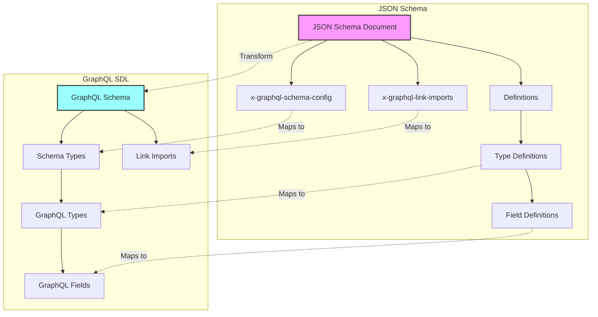
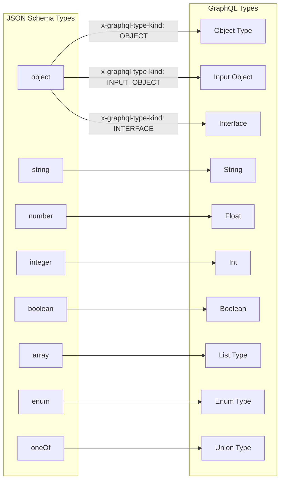
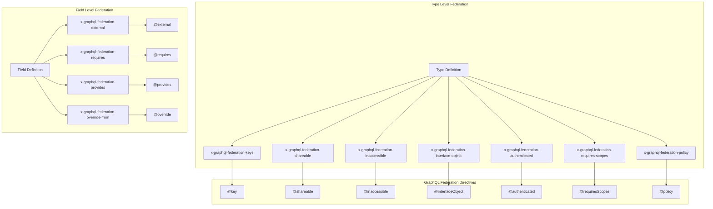
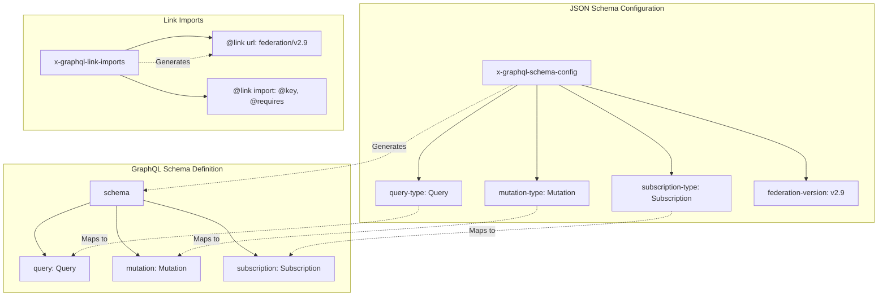
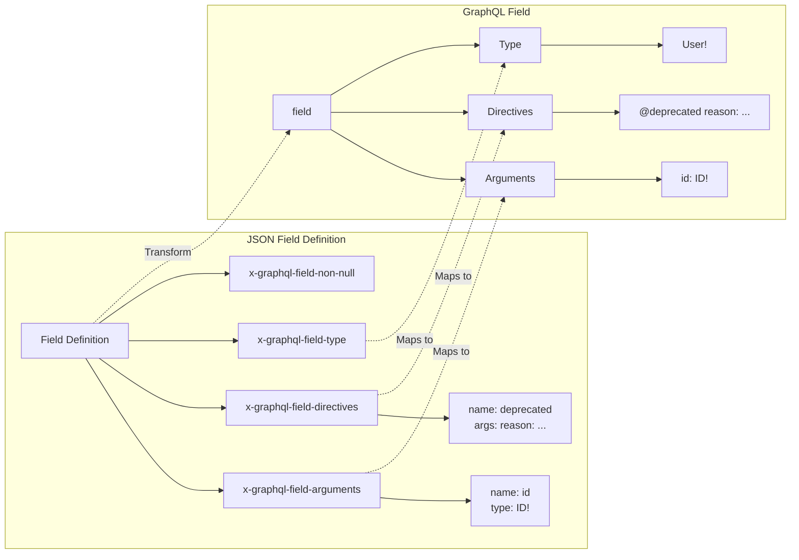
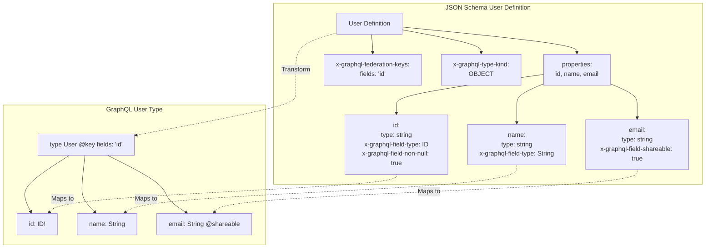
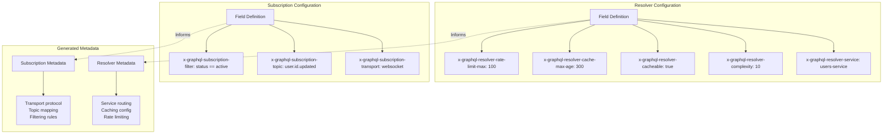

# JSON Schema x GraphQL

**Bidirectional, lossless conversion between JSON Schema and GraphQL SDL using standardized `x-graphql-*` extensions**


[](https://json-schema.org/draft/2020-12/json-schema-core.html)
[](https://spec.graphql.org/October2021/)
[](https://www.apollographql.com/docs/federation/)

---

## Overview

This project establishes a **canonical pattern** for maintaining JSON Schema as the single source of truth while generating fully-featured GraphQL SDL with complete Apollo Federation support. It solves the fundamental impedance mismatch between JSON Schema's validation-first model and GraphQL's API-first type system.

### The Problem

Current GraphQL tooling forces you to choose:
- **Schema-first (SDL)** → Lose robust data validation capabilities
- **Code-first** → Lose declarative schema benefits and git-friendly diffs
- **Introspection JSON** → Lose all directives and custom metadata

Existing converters like `jsonschema2graphql` lose critical information:
- ❌ All directive applications (`@deprecated`, `@key`, `@requires`, etc.)
- ❌ Field arguments and default values
- ❌ Apollo Federation metadata
- ❌ Custom scalar mappings
- ❌ Enum value configurations

### The Solution

**JSON Schema with `x-graphql-*` extensions** provides:
- ✅ **Validation-first workflow**: Validate data before it hits your database
- ✅ **Lossless round-tripping**: SDL → JSON Schema → SDL preserves 100% of metadata
- ✅ **Full Federation support**: All Apollo Federation v2.9 directives
- ✅ **Single source of truth**: One schema for validation AND API
- ✅ **Git-friendly**: Human-readable JSON with clear diffs
- ✅ **Standards-compliant**: JSON Schema 2020-12, GraphQL October 2021

---

## Quick Start

### Example: User Entity with Federation

**JSON Schema** (`user.schema.json`):
```json
{
  "$schema": "https://json-schema.org/draft/2020-12/schema",
  "$defs": {
    "User": {
      "type": "object",
      "description": "A user in the system",
      "properties": {
        "user_id": {
          "type": "string",
          "x-graphql-field-name": "id",
          "x-graphql-field-type": "ID!",
          "x-graphql-field-non-null": true
        },
        "username": {
          "type": "string",
          "minLength": 3,
          "maxLength": 50,
          "x-graphql-field-name": "username",
          "x-graphql-field-type": "String!",
          "x-graphql-field-non-null": true,
          "x-graphql-federation-shareable": true
        },
        "email_address": {
          "type": "string",
          "format": "email",
          "x-graphql-field-name": "email",
          "x-graphql-field-type": "String!",
          "x-graphql-field-non-null": true,
          "x-graphql-federation-authenticated": true
        }
      },
      "required": ["user_id", "username", "email_address"],
      "x-graphql-type-name": "User",
      "x-graphql-type-kind": "OBJECT",
      "x-graphql-federation-keys": [
        {
          "fields": "id",
          "resolvable": true
        }
      ]
    }
  }
}
```

**Generated GraphQL SDL**:
```graphql
"""A user in the system"""
type User @key(fields: "id") {
  id: ID!
  username: String! @shareable
  email: String! @authenticated
}
```

### Installation

```bash
# NPM
npm install json-schema-x-graphql

# Yarn
yarn add json-schema-x-graphql

# Cargo
cargo add json-schema-x-graphql
```

### Usage

#### JavaScript/TypeScript

```typescript
import { convertSdlToJson, convertJsonToSdl } from 'json-schema-x-graphql';

// SDL → JSON Schema
const jsonSchema = await convertSdlToJson(`
  type Product @key(fields: "id") {
    id: ID!
    name: String!
    price: Float
  }
`);

// JSON Schema → SDL
const sdl = await convertJsonToSdl(jsonSchema);
console.log(sdl);
```

#### Rust

```rust
use json_schema_x_graphql::{SdlToJsonSchema, JsonSchemaToSdl};

// SDL → JSON Schema
let json_schema = SdlToJsonSchema::convert(sdl_string)?;

// JSON Schema → SDL
let sdl = JsonSchemaToSdl::convert(&json_schema)?;
```

---

## Features

### Core Capabilities

- **Bidirectional Conversion**: Lossless SDL ↔ JSON Schema transformation
- **Type System Complete**: All GraphQL types (Object, Interface, Union, Enum, Input, Scalar)
- **Apollo Federation v2.9**: Full support for all federation directives
- **Field Arguments**: Preserve arguments with defaults and types
- **Custom Directives**: Define and apply custom directives
- **Enum Metadata**: Per-value descriptions and deprecation
- **Subscriptions**: Transport and topic configuration
- **Performance**: Sub-5ms conversion via WASM

### Apollo Federation Support

All Federation v2.9 directives are supported:

**Entity Directives**:
- `@key(fields: "id", resolvable: true)` → `x-graphql-federation-keys`
- `@shareable` → `x-graphql-federation-shareable`
- `@inaccessible` → `x-graphql-federation-inaccessible`
- `@interfaceObject` → `x-graphql-federation-interface-object`

**Field-Level Directives**:
- `@external` → `x-graphql-federation-external`
- `@requires(fields: "category")` → `x-graphql-federation-requires`
- `@provides(fields: "name")` → `x-graphql-federation-provides`
- `@override(from: "old-service", label: "percent(50)")` → `x-graphql-federation-override-from`

**Authorization Directives** (v2.5+):
- `@authenticated` → `x-graphql-federation-authenticated`
- `@requiresScopes` → `x-graphql-federation-requires-scopes`
- `@policy` → `x-graphql-federation-policy`

**Demand Control** (v2.9+):
- `@cost(weight: 5)` → `x-graphql-federation-cost-weight`
- `@listSize(assumedSize: 50)` → `x-graphql-federation-list-size-assumed-size`

---

## Architecture

### Three-Namespace Design

The system uses three distinct naming conventions for semantic isolation:

1. **`snake_case`** - JSON Schema properties (database/validation domain)
   ```json
   { "user_id": "123", "created_at": "2024-01-01" }
   ```

2. **`camelCase`** - GraphQL SDL fields (API domain)
   ```graphql
   { userId: "123", createdAt: "2024-01-01" }
   ```

3. **`hyphen-case`** - Extension metadata keys (tooling domain)
   ```json
   { "x-graphql-field-name": "userId" }
   ```

### Minimal Extension Set

Only **15 core fields** are required for lossless round-tripping:

**Always Required**:
- `x-graphql-type-name` - Type name (PascalCase)
- `x-graphql-type-kind` - OBJECT | INTERFACE | UNION | ENUM | INPUT_OBJECT | SCALAR
- `x-graphql-field-name` - Field name (camelCase)
- `x-graphql-field-type` - GraphQL type reference

**Required When Applicable**:
- `x-graphql-field-non-null` - Non-nullable field (`!`)
- `x-graphql-field-list-item-non-null` - Non-nullable list items (`[Item!]`)
- `x-graphql-argument-default-value` - Argument defaults

**Federation Required**:
- `x-graphql-federation-keys` - Entity keys
- `x-graphql-federation-requires` - Required field sets
- `x-graphql-federation-provides` - Provided field sets
- `x-graphql-federation-external` - External field marker
- `x-graphql-federation-shareable` - Shareable marker
- `x-graphql-federation-override-from` - Migration source

**Optional Arrays**:
- `x-graphql-type-directives` - Type-level directives
- `x-graphql-field-directives` - Field-level directives
- `x-graphql-field-arguments` - Field arguments
- `x-graphql-enum-value-configs` - Enum value metadata

---

## Use Cases

### 1. Data Validation Pipelines

```
Incoming Data → JSON Schema Validation → Database
       ↓
    GraphQL API (generated from same schema)
```

**Benefits**:
- Validate data before persistence
- Single source of truth for structure
- Automatic API generation with type safety

### 2. Microservices with Federation

```
Service A: User Schema (JSON Schema)
Service B: Order Schema (JSON Schema)
    ↓
Apollo Router (federated GraphQL)
```

**Benefits**:
- Each service validates its own data
- Federation directives preserved
- Consistent entity resolution

### 3. Schema Evolution & Versioning

```
v1.schema.json → Git → v2.schema.json
       ↓                    ↓
    v1.graphql          v2.graphql
```

**Benefits**:
- Track schema changes in version control
- Automated SDL generation from JSON
- Clear migration paths with diffs

---

## Performance

Optimized for real-time editing and CI/CD pipelines:

| Operation | Performance | Method |
|-----------|-------------|--------|
| SDL → JSON | < 5ms | WASM with LRU cache |
| JSON → SDL | < 5ms | WASM with LRU cache |
| Validation | < 1ms | Standard JSON Schema validators |
| WASM Binary | < 150KB gzipped | Rust optimization flags |

---

## Documentation

- 📘 [Complete Specification](docs/SPECIFICATION.md) - Detailed `x-graphql-*` extension reference
- 🎓 [Integration Guide](docs/INTEGRATION.md) - Add to your existing projects
- 🏗️ [Architecture](docs/ARCHITECTURE.md) - Design decisions and trade-offs
- 💡 [Examples](examples/) - Comprehensive schema examples
- 🔧 [API Reference](docs/API.md) - Full API documentation

---

## Comparison with Alternatives

| Feature | This Project | jsonschema2graphql | GraphQL Introspection | Code-First |
|---------|--------------|-------------------|---------------------|-----------|
| Directives | ✅ Full support | ❌ None | ❌ Lost | ⚠️ Language-specific |
| Federation | ✅ v2.9 | ❌ None | ❌ Lost | ⚠️ Partial |
| Bidirectional | ✅ Lossless | ❌ One-way | ⚠️ Lossy | ❌ One-way |
| Field Arguments | ✅ With defaults | ❌ None | ✅ Yes | ✅ Yes |
| Data Validation | ✅ JSON Schema | ⚠️ Manual | ⚠️ Manual | ⚠️ Manual |
| Git-Friendly | ✅ Yes | ✅ Yes | ❌ Verbose | ⚠️ Language files |
| Standards-Based | ✅ 100% | ⚠️ Partial | ✅ Yes | ❌ No |

---

## Project Status

**Current Version**: 0.1.0 (Alpha)  
**Current Phase**: 3A - Local Testing Infrastructure

### Completed ✅
- ✅ Meta-schema definition (JSON Schema 2020-12)
- ✅ Comprehensive example schemas
- ✅ Architecture documentation
- ✅ Project context and roadmap
- ✅ **Phase 2: Core Implementation**
  - ✅ Rust converter (2,800+ lines, WASM-ready)
  - ✅ Node.js converter (1,900+ lines, TypeScript)
  - ✅ Test data (user-service schema)
  - ✅ Documentation (READMEs, API docs)
- ✅ **Phase 3A: Testing Infrastructure**
  - ✅ Rust integration tests (603 lines)
  - ✅ Node.js integration tests (712 lines)
  - ✅ Test runner scripts
  - ✅ Parity validation script

### In Progress 🚧
- 🚧 Running comprehensive test suite
- 🚧 Achieving 80%+ code coverage
- 🚧 Validating converter parity

### Next: Phase 3B 📋
- 📋 Web UI Editor with three-panel layout
- 📋 GraphQL Editor integration ([graphql-editor](https://github.com/graphql-editor/graphql-editor))
- 📋 Node.js/WASM converter toggle
- 📋 Real-time bidirectional conversion
- 📋 Sample schemas and import/export

### Future Roadmap
- 📋 npm/crates.io publication
- 📋 Video tutorials and examples
- 📋 Community contributions and feedback

----
## Diagrams

## Overview



```mermaid
graph LR
    %% Data Sources
    subgraph "Data Sources"
        DB[(Databricks)]
        REST1[REST API 1]
        REST2[REST API 2]
        KAFKA[Kafka Stream]
        S3[(S3/Data Lake)]
    end

    %% JSON Schema Validation Layer
    subgraph "JSON Schema"
        VAL[Schema Validator]
        TRANSFORM[ETL Transform]
        
        subgraph "Schemas"
            JS1[System 1 Schema]
            JS2[System 2 Schema]
            JS3[System 3 Schema]
        end
    end

    %% Converter
    subgraph "GraphQL Schema"
        CONV[x-graphql<br/>Converter]
        INFER[Type Inference<br/>Engine]
    end

    %% GraphQL Subgraphs
    subgraph "GraphQL Federation"
        subgraph "Subgraphs"
            SG1[System 1<br/>Subgraph]
            SG2[System 2<br/>Subgraph]
            SG3[System 3<br/>Subgraph]
        end
        
        GATEWAY[Supergraph / API gateway]
        
        subgraph "Clients"
            WEB[GraphQL API]
            MOBILE[REST API]
            API[Gen AI]
        end
    end

    %% Data Flow
    DB -->|Raw Data| VAL
    REST1 -->|JSON| VAL
    REST2 -->|JSON| VAL
    KAFKA -->|Stream| VAL
    S3 -->|Batch| VAL
    
    VAL -->|Validate| JS1
    VAL -->|Validate| JS2
    VAL -->|Validate| JS3
    
    JS1 -->|Transform| TRANSFORM
    JS2 -->|Transform| TRANSFORM
    JS3 -->|Transform| TRANSFORM
    
    TRANSFORM -->|Enhanced Schema| CONV
    CONV -->|Infer Types| INFER
    
    INFER -->|Generate SDL| SG1
    INFER -->|Generate SDL| SG2
    INFER -->|Generate SDL| SG3
    
    SG1 -->|Compose| GATEWAY
    SG2 -->|Compose| GATEWAY
    SG3 -->|Compose| GATEWAY
    
    GATEWAY -->|GraphQL| WEB
    GATEWAY -->|GraphQL| MOBILE
    GATEWAY -->|GraphQL| API

    %% Styling
    classDef datasource fill:#2c3e50,stroke:#34495e,color:#fff
    classDef validation fill:#e67e22,stroke:#d35400,color:#fff
    classDef converter fill:#e74c3c,stroke:#c0392b,color:#fff
    classDef subgraphNode fill:#3498db,stroke:#2980b9,color:#fff
    classDef gateway fill:#9b59b6,stroke:#8e44ad,color:#fff
    classDef client fill:#1abc9c,stroke:#16a085,color:#fff
    
    class DB,REST1,REST2,KAFKA,S3 datasource
    class VAL,TRANSFORM,JS1,JS2,JS3 validation
    class CONV,INFER converter
    class SG1,SG2,SG3 subgraphNode
    class GATEWAY gateway
    class WEB,MOBILE,API client

    %% Labels
    DB -.->|"ETL Pipeline"| VAL
    CONV -.->|"x-graphql extensions"| INFER
    GATEWAY -.->|"Federated Schema"| WEB
```

## 1. Overview: JSON Schema to GraphQL SDL Transformation



## 2. Type Mapping: JSON Schema Types to GraphQL Types



## 3. Federation Directives Flow (Fixed)



## 4. Schema Configuration and Root Types (Fixed)



## 5. Field Arguments and Directives Transformation (Fixed)



## 6. Complete Example: User Entity Transformation



## 7. Resolver and Subscription Extensions (Fixed)



## Contributing

We welcome contributions! This project aims to become the **standard** for JSON Schema ↔ GraphQL conversion.

### How to Contribute

1. **Open an Issue**: Discuss new features or report bugs
2. **Submit a PR**: Follow our contribution guidelines
3. **Improve Docs**: Help clarify usage and examples
4. **Share Feedback**: Tell us how you're using this pattern

See [CONTRIBUTING.md](CONTRIBUTING.md) for detailed guidelines.

### Development Setup

```bash
# Clone repository
git clone https://github.com/JJediny/json-schema-x-graphql.git
# json-schema-x-graphql

> **Advanced Usage**: For a deep dive into `x-graphql` overrides, Apollo Federation support, and complex type definitions, please refer to the [Comprehensive Guide](docs/COMPREHENSIVE_GUIDE.md).

# Build WASM module
npm run build:wasm

# OR manually:
cd converters/rust
wasm-pack build --target web --release
cd ../..

# Install frontend dependencies
cd frontend
npm install

# Run tests
npm test
# Rust tests: cd converters/rust && cargo test
```

---

## Community

- 💬 [GitHub Discussions](https://github.com/JJediny/json-schema-x-graphql/discussions) - Ask questions, share ideas
- 🐛 [Issue Tracker](https://github.com/JJediny/json-schema-x-graphql/issues) - Report bugs, request features
- 📢 [Release Notes](CHANGELOG.md) - Stay updated on changes

---

## License

[MIT License](LICENSE) - Use freely in commercial and open-source projects.

---

## Citation

If you use this project in research or production, please cite:

```bibtex
@software{json_schema_x_graphql,
  title = {JSON Schema x GraphQL: Bidirectional Schema Conversion},
  author = {JJediny and Contributors},
  year = {2024},
  url = {https://github.com/JJediny/json-schema-x-graphql}
}
```

---

## Acknowledgments

- **Apollo GraphQL** - Federation specification and ecosystem
- **JSON Schema Community** - Robust validation standards
- **Rust Community** - Amazing WASM tooling
- **Prior Art**: jsonschema2graphql, graphql-json-to-sdl, OpenAPI extensions

---

**Built with ❤️ by the community**

*Questions? Open an [issue](https://github.com/JJediny/json-schema-x-graphql/issues) or start a [discussion](https://github.com/JJediny/json-schema-x-graphql/discussions).*
