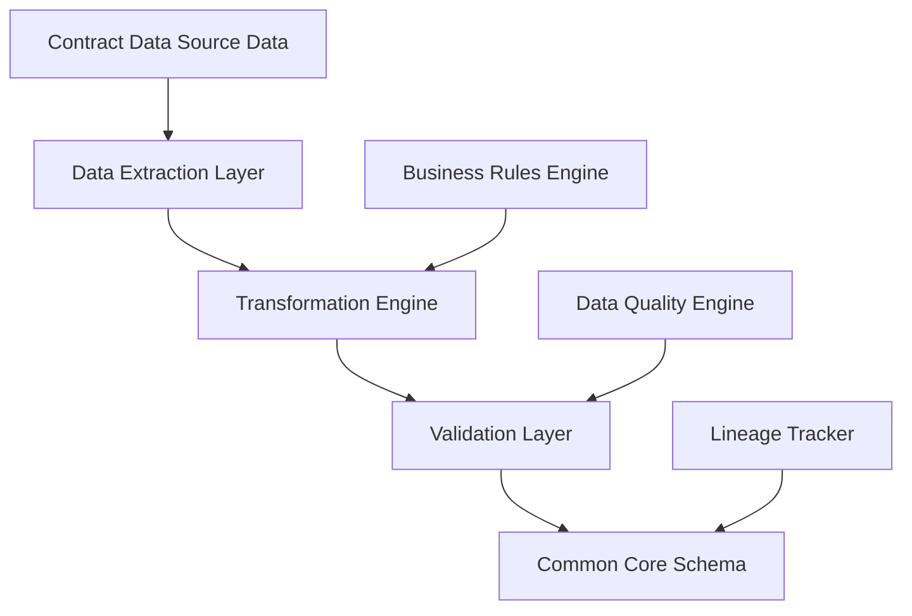

# Comprehensive Guide: Contract Data to Common Core Schema Transformation

## Table of Contents

1. [Overview and Architecture](#overview)
2. [Schema Mapping Framework](#mapping-framework)
3. [Data Type Transformations](#data-types)
4. [Data Provenance and Lineage](#provenance)
5. [Complex Concept Handling](#complex-concepts)
6. [Transformation Rules and Business Logic](#transformation-rules)
7. [Quality Assurance and Validation](#quality-assurance)
8. [Implementation Guidelines](#implementation)

## 1. Overview and Architecture {#overview}

### 1.1 Contract Data System Context

The Federal Procurement Data System (Contract Data) serves as the central repository for federal legacy_procurementance program data, managing complex hierarchical program structures, eligibility criteria, and multi-year financial obligations. Unlike procurement-focused systems (Legacy Procurement/EASi), Contract Data emphasizes program lifecycle management and beneficiary tracking.

### 1.2 Transformation Objectives

- **Normalize** Contract Data's complex nested structures into the common core schema
- **Preserve** rich program metadata while ensuring interoperability
- **Standardize** data types and formats across system boundaries
- **Maintain** full audit trail and data lineage
- **Enable** seamless integration with Legacy Procurement and EASi systems

### 1.3 Architecture Overview



## 2. Schema Mapping Framework {#mapping-framework}

### 2.1 Core Mapping Strategy

The transformation follows a **hierarchical flattening** approach, where Contract Data's deeply nested JSON structures are mapped to the normalized schema's more accessible field structure.

#### Primary Mapping Categories:

- **Direct Mappings**: 1:1 field correspondence
- **Derived Mappings**: Calculated or transformed values
- **Hierarchical Flattening**: Complex objects to simple fields
- **Aggregation Mappings**: Multiple source fields to single target
- **Conditional Mappings**: Business rule-based transformations

### 2.2 Mapping Table: Contract Data to Common Core

| Common Core Field                                 | Contract Data Source Path                        | Transformation Type | Business Rules                                      |
| ------------------------------------------------- | ------------------------------------------------ | ------------------- | --------------------------------------------------- |
| `systemMetadata.primarySystem`                    | Static value                                     | Direct              | Always "Contract Data"                              |
| `systemMetadata.globalRecordId`                   | `programNumber`                                  | Prefixed            | "Contract Data-" + programNumber                    |
| `contractIdentification.piid`                     | `data.programNumber`                             | Direct              | Must be unique across systems                       |
| `contractIdentification.contractTitle`            | `data.title`                                     | Direct              | Trim and clean whitespace                           |
| `contractIdentification.contractType`             | `legacy_procurementanceTypes.hierarchy[0].value` | Hierarchical        | Extract top-level legacy_procurementance type       |
| `contractIdentification.descriptionOfRequirement` | `data.objective`                                 | Direct              | Full program objective text                         |
| `organizationInfo.contractingAgency.code`         | `organizationHierarchy[0].organizationId`        | Hierarchical        | Root organization ID                                |
| `organizationInfo.contractingAgency.name`         | `organizationHierarchy[0].name`                  | Hierarchical        | Root organization name                              |
| `vendorInfo.vendorName`                           | `contacts.headquarters[0].fullName`              | Contact Extraction  | Primary headquarters contact                        |
| `placeOfPerformance.city`                         | `contacts.headquarters[0].address.city`          | Contact Address     | Primary headquarters address                        |
| `financialInfo.totalContractValue`                | `financial.obligations[].values.actual`          | Aggregation         | Sum all actual obligation values                    |
| `businessClassification.naicsCode`                | `legacy_procurementanceTypes.hierarchy[].code`   | Complex Derivation  | Map legacy_procurementance type to NAICS equivalent |

### 2.3 Dot Notation Field References

Contract Data uses complex nested structures that require careful dot notation handling:

```json
// Contract Data Source Structure
{
  "data": {
    "programNumber": "10.001",
    "title": "SBA 8(a) Business Development Program"
  },
  "organizationHierarchy": [
    {
      "organizationId": "073",
      "name": "Small Business Administration",
      "level": 1,
      "children": [
        {
          "organizationId": "073-01",
          "name": "Office of Business Development",
          "level": 2
        }
      ]
    }
  ]
}

// Common Core Mapping
{
  "contractIdentification": {
    "piid": "data.programNumber",           // "10.001"
    "contractTitle": "data.title"          // "SBA 8(a) Business Development Program"
  },
  "organizationInfo": {
    "contractingAgency": {
      "code": "organizationHierarchy[0].organizationId",    // "073"
      "name": "organizationHierarchy[0].name"               // "Small Business Administration"
    },
    "contractingDepartment": {
      "code": "organizationHierarchy[0].children[0].organizationId",  // "073-01"
      "name": "organizationHierarchy[0].children[0].name"             // "Office of Business Development"
    }
  }
}
```

## 3. Data Type Transformations {#data-types}

### 3.1 Primitive Type Mappings

| Contract Data Data Type | Common Core Type     | Transformation Rule       | Example                                   |
| ----------------------- | -------------------- | ------------------------- | ----------------------------------------- |
| `string`                | `string`             | Direct copy with trimming | `"10.001"` → `"10.001"`                   |
| `number`                | `decimal`            | Precision standardization | `1500000.00` → `1500000.00`               |
| `boolean`               | `boolean`            | Direct mapping            | `true` → `true`                           |
| `date`                  | `string (date-time)` | ISO 8601 conversion       | `"2024-01-15"` → `"2024-01-15T00:00:00Z"` |
| `array`                 | `json` or flattened  | Context-dependent         | See complex handling below                |
| `object`                | `json` or decomposed | Structure-dependent       | See hierarchical handling                 |

### 3.2 Complex Type Handling

#### 3.2.1 Financial Obligations Array

```json
// Contract Data Source
{
  "financial": {
    "obligations": [
      {
        "fiscalYear": "2024",
        "values": {
          "actual": 1500000.00,
          "estimate": 2000000.00
        },
        "type": "Grant"
      }
    ]
  }
}

// Common Core Transformation
{
  "financialInfo": {
    "totalContractValue": 1500000.00,        // Sum of actual values
    "baseAndAllOptionsValue": 2000000.00,    // Sum of estimates
    "contractFiscalYear": "2024"             // Most recent fiscal year
  }
}
```

#### 3.2.2 Assistance Types Hierarchy

```json
// Contract Data Source
{
  "legacy_procurementanceTypes": [
    {
      "hierarchy": [
        {
          "code": "B",
          "value": "Project Grants",
          "level": 1,
          "elementId": "GRANT_001"
        },
        {
          "code": "B01",
          "value": "Business Development Grants",
          "level": 2,
          "elementId": "GRANT_BUS_001"
        }
      ]
    }
  ]
}

// Common Core Transformation
{
  "contractIdentification": {
    "contractType": "Project Grants"  // Level 1 value
  },
  "businessClassification": {
    "naicsCode": "B",                 // Top-level code
    "pscCode": "GRANT_001",          // ElementId as PSC equivalent
    "categoryOfProduct": "Project Grants",
    "typeOfProduct": "Business Development Grants"
  },
  "systemExtensions": {
    "contract_data": [{
      "contract_dataSpecific": {
        "legacy_procurementanceTypes": [/* Full hierarchy preserved */]
      }
    }]
  }
}
```

### 3.3 Enumeration and Code Mappings

#### 3.3.1 Status Code Transformations

```yaml
contract_data_status_mapping:
  published: "awarded"
  draft: "draft"
  archived: "completed"
  suspended: "cancelled"

common_core_status_enum:
  ["draft", "published", "awarded", "completed", "cancelled"]
```

#### 3.3.2 Contact Role Standardization

```yaml
contract_data_contact_roles:
  "Program Officer": "primary"
  "Technical Contact": "technical"
  "Administrative Contact": "administrative"
  "Grants Management Officer": "contracting_officer"
```

## 4. Data Provenance and Lineage {#provenance}

### 4.1 Provenance Tracking Architecture

```json
{
  "systemMetadata": {
    "systemChain": [
      {
        "systemName": "Contract Data",
        "recordId": "Contract Data-10.001-2024",
        "processedDate": "2024-01-18T10:45:00Z",
        "transformationRules": [
          "contract_data_program_ingestion",
          "federal_legacy_procurementance_validation",
          "hierarchy_processing"
        ],
        "dataQuality": {
          "completenessScore": 0.91,
          "validationErrors": [],
          "lastValidated": "2024-01-18T10:45:00Z"
        }
      }
    ]
  }
}
```

### 4.2 Field-Level Lineage Tracking

Each transformed field maintains lineage information:

```json
{
  "fieldLineage": {
    "contractIdentification.piid": {
      "sourceSystem": "Contract Data",
      "sourcePath": "data.programNumber",
      "transformationApplied": "direct_mapping",
      "transformationDate": "2024-01-18T10:45:00Z",
      "dataQuality": {
        "confidence": 1.0,
        "validationPassed": true
      }
    },
    "financialInfo.totalContractValue": {
      "sourceSystem": "Contract Data",
      "sourcePath": "financial.obligations[*].values.actual",
      "transformationApplied": "aggregation_sum",
      "transformationDate": "2024-01-18T10:45:00Z",
      "businessRule": "sum_actual_obligations_all_years",
      "dataQuality": {
        "confidence": 0.95,
        "validationPassed": true,
        "notes": "Aggregated from 3 fiscal year records"
      }
    }
  }
}
```

### 4.3 Data Quality Inheritance

Quality scores flow through transformations:

```yaml
quality_inheritance_rules:
  direct_mapping:
    inherit_score: true
    minimum_confidence: 0.9

  aggregation_mapping:
    inherit_score: false
    calculated_confidence: "min(source_scores) * 0.95"

  derived_mapping:
    inherit_score: false
    business_rule_confidence: 0.85
```

## 5. Complex Concept Handling {#complex-concepts}

### 5.1 Hierarchical Organization Structures

Contract Data maintains complex multi-level organizational hierarchies that must be flattened for the common core schema:

#### Source Structure Analysis

```json
{
  "organizationHierarchy": [
    {
      "organizationId": "073",
      "name": "Small Business Administration",
      "level": 1,
      "status": "active",
      "children": [
        {
          "organizationId": "073-01",
          "name": "Office of Business Development",
          "level": 2,
          "status": "active",
          "children": [
            {
              "organizationId": "073-01-001",
              "name": "8(a) Business Development Division",
              "level": 3,
              "status": "active"
            }
          ]
        }
      ]
    }
  ]
}
```

#### Transformation Strategy

```javascript
// Hierarchy Flattening Algorithm
function flattenOrganizationHierarchy(hierarchy) {
  const result = {
    contractingAgency: extractLevel(hierarchy, 1),
    contractingDepartment: extractLevel(hierarchy, 2),
    contractingOffice: extractLevel(hierarchy, 3),
  };

  // Preserve full hierarchy in extensions
  result.fullHierarchy = hierarchy;
  return result;
}

function extractLevel(hierarchy, targetLevel) {
  function traverse(node) {
    if (node.level === targetLevel) {
      return {
        code: node.organizationId,
        name: node.name,
        status: node.status,
      };
    }
    if (node.children) {
      for (let child of node.children) {
        const found = traverse(child);
        if (found) return found;
      }
    }
    return null;
  }

  return traverse(hierarchy[0]);
}
```

### 5.2 Multi-Dimensional Eligibility Criteria

Contract Data eligibility structures contain complex nested criteria that must be normalized:

#### Source Structure

```json
{
  "eligibility": {
    "applicant": {
      "types": [
        { "code": "25", "value": "Small businesses" },
        { "code": "21", "value": "Socially disadvantaged" }
      ],
      "legacy_procurementanceUsageTypes": [
        { "code": "BUS", "value": "Business development" },
        { "code": "TRN", "value": "Training programs" }
      ],
      "additionalInfo": "Must meet SBA size standards and demonstrate social/economic disadvantage"
    },
    "beneficiary": {
      "types": [
        { "code": "10", "value": "Small Business Person" },
        { "code": "11", "value": "Minority group" }
      ],
      "additionalInfo": "Direct benefit to disadvantaged business owners"
    }
  }
}
```

#### Transformation Approach

```javascript
// Eligibility Normalization
function normalizeEligibility(eligibility) {
  return {
    // Extract primary classification for common core
    setAsideType: eligibility.applicant.types[0]?.value || "Open Competition",

    // Preserve detailed eligibility in extensions
    fullEligibilityStructure: eligibility,

    // Create searchable eligibility summary
    eligibilitySummary: {
      primaryApplicantType: eligibility.applicant.types[0]?.value,
      primaryBeneficiaryType: eligibility.beneficiary.types[0]?.value,
      additionalRequirements: eligibility.applicant.additionalInfo,
    },
  };
}
```

### 5.3 Financial Obligations and Time Series Data

Contract Data maintains multi-year financial data with complex obligation structures:

#### Source Complexity

```json
{
  "financial": {
    "obligations": [
      {
        "obligationId": "OBL-2024-001",
        "fiscalYear": "2024",
        "values": {
          "actual": 1500000.00,
          "estimate": 2000000.00,
          "flag": "current"
        },
        "legacy_procurementanceType": {
          "code": "B",
          "value": "Project Grants"
        }
      },
      {
        "obligationId": "OBL-2025-001",
        "fiscalYear": "2025",
        "values": {
          "actual": 0.00,
          "estimate":
```
