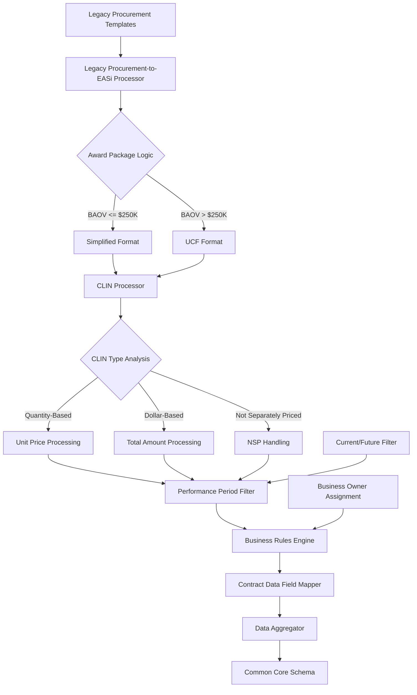

# Comprehensive Guide: EASi to Common Core Schema Transformation

## Table of Contents

1. [Overview and Architecture](#overview)
2. [Schema Mapping Framework](#mapping-framework)
3. [Data Type Transformations](#data-types)
4. [Data Provenance and Lineage](#provenance)
5. [Complex Concept Handling](#complex-concepts)
6. [CLIN-Level Processing Architecture](#clin-processing)
7. [Contract Data Integration Preparation](#contract_data-integration)
8. [Business Rules and Award Package Logic](#business-rules)
9. [Quality Assurance and Validation](#quality-assurance)
10. [Implementation Guidelines](#implementation)

## 1. Overview and Architecture {#overview}

### 1.1 EASi System Context

Enterprise Architecture and Systems Integration (EASi) serves as the **integration hub** between internal GSA procurement systems and external federal reporting requirements. EASi operates at the **Contract Line Item Number (CLIN) level**, providing granular pricing and performance period management while preparing data for Contract Data compliance reporting.

### 1.2 Key EASi Characteristics

- **CLIN-Level Granularity**: Manages individual contract line items with detailed pricing
- **Dual-Role Architecture**: Internal GSA operations + external Contract Data reporting bridge
- **Award Package Processing**: Applies UCF/Simplified format rules based on contract value
- **Performance Period Management**: Tracks current and future CLIN performance periods
- **Business Owner Integration**: Links contracts to specific business process owners
- **Contract Data Field Mapping**: Direct preparation of data for federal reporting compliance

### 1.3 Transformation Objectives

- **CLIN Aggregation**: Roll up line-item data to contract-level summaries
- **Award Package Normalization**: Standardize UCF/Simplified processing differences
- **Performance Period Filtering**: Include only current/future performance periods
- **Contract Data Preparation**: Structure data for seamless federal reporting
- **Business Context Preservation**: Maintain EASi-specific business owner information
- **Quality Enhancement**: Improve data completeness through EASi processing logic

### 1.4 Architecture Overview



## 2. Schema Mapping Framework {#mapping-framework}

### 2.1 CLIN-to-Contract Aggregation Strategy

EASi's primary complexity lies in **aggregating CLIN-level data** to contract-level summaries for the common core schema while preserving detailed line-item information in system extensions.

#### Aggregation Hierarchy:

1. **CLIN Level** → Individual line items with pricing/performance details
2. **Contract Level** → Aggregated totals and primary characteristics
3. **Contract Data Level** → Compliance-ready reporting fields
4. **Common Core** → Normalized cross-system structure

### 2.2 Primary Mapping Table: EASi to Common Core

| Common Core Field                                     | EASi Source Path                           | Aggregation Type | Business Rules                        | Contract Data Preparation               |
| ----------------------------------------------------- | ------------------------------------------ | ---------------- | ------------------------------------- | --------------------------------------- |
| `systemMetadata.primarySystem`                        | Static                                     | N/A              | Always "Intake Process"               | N/A                                     |
| `systemMetadata.globalRecordId`                       | `contract.piid`                            | Prefixed         | "Intake Process-" + PIID              | N/A                                     |
| `contractIdentification.piid`                         | `contract.piid`                            | Direct           | Primary contract identifier           | Maps to Contract Data PIID              |
| `contractIdentification.contractType`                 | `contract.type`                            | Direct           | Derived from award package format     | Maps to Contract Data contract type     |
| `organizationInfo.contractingAgency.code`             | `organization.contractingAgencyCode`       | Direct           | GSA code (047)                        | Contract Data contracting agency        |
| `organizationInfo.fundingAgency.code`                 | `organization.fundingAgencyCode`           | Direct           | Client agency from Legacy Procurement | Contract Data funding agency            |
| `vendorInfo.vendorName`                               | `vendor.name`                              | Direct           | Prime contractor                      | Contract Data vendor identification     |
| `vendorInfo.vendorUei`                                | `vendor.uei`                               | Direct           | Entity Management.gov registration    | Contract Data UEI requirement           |
| `placeOfPerformance.city`                             | `placeOfPerformance.city`                  | Direct           | Primary performance location          | Contract Data place of performance      |
| `placeOfPerformance.state`                            | `placeOfPerformance.state`                 | Direct           | Performance state                     | Contract Data geographic data           |
| `placeOfPerformance.congressionalDistrict`            | `placeOfPerformance.congressionalDistrict` | Direct           | Political boundary                    | Contract Data congressional district    |
| `financialInfo.totalContractValue`                    | `clin[*].totalAmount`                      | Sum Aggregation  | Sum all CLIN total amounts            | Contract Data total contract value      |
| `financialInfo.baseAndAllOptionsValue`                | `financial.baseAndAllOptions`              | Direct           | Base + option period values           | Contract Data BAOV                      |
| `financialInfo.amountSpentOnProduct`                  | `clin[*].extendedAmount`                   | Sum Aggregation  | Sum current period CLINs              | Contract Data obligation amount         |
| `businessClassification.naicsCode`                    | `naicsCode`                                | Direct           | Primary NAICS                         | Contract Data Principal NAICS Code      |
| `businessClassification.pscCode`                      | `pscCode`                                  | Direct           | Product service code                  | Contract Data PSC                       |
| `businessClassification.localAreaSetAside`            | `setAsideForLocalFirms`                    | Boolean          | Local preference                      | Contract Data Local Area Set Aside      |
| `contractCharacteristics.governmentFurnishedProperty` | `governmentFurnishedProperty`              | Boolean          | GFP indicator                         | Contract Data GFP Provided Under Action |
| `contractCharacteristics.emergencyAcquisition`        | `emergencyAcquisition`                     | Direct           | Emergency classification              | Contract Data emergency indicator       |

### 2.3 CLIN-Level Data Structure

EASi maintains detailed CLIN structures that inform contract-level aggregations:

```json
{
  "clinStructure": {
    "contractId": "Intake Process-CLIN-001-2024",
    "clins": [
      {
        "clinNumber": "0001",
        "clinType": "quantity_based",
        "unitPrice": 125.5,
        "unitOfMeasure": "Hour",
        "quantity": 2000,
        "extendedAmount": 251000.0,
        "performancePeriod": {
          "startDate": "2024-02-01",
          "endDate": "2025-01-31",
          "periodType": "base"
        },
        "optional": "Base Period",
        "notToExceed": "275000.00",
        "notSeparatelyPriced": false
      },
      {
        "clinNumber": "0002",
        "clinType": "dollar_based",
        "totalAmount": 50000.0,
        "performancePeriod": {
          "startDate": "2025-02-01",
          "endDate": "2026-01-31",
          "periodType": "option_1"
        },
        "optional": "Option Year 1",
        "notToExceed": "55000.00",
        "notSeparatelyPriced": false
      }
    ],
    "aggregatedTotals": {
      "totalContractValue": 301000.0,
      "baseAndAllOptions": 330000.0,
      "currentPeriodValue": 251000.0
    }
  }
}
```

### 2.4 Award Package Format Integration

EASi applies different processing rules based on Base and All Options Value (BAOV):

```json
{
  "awardPackageLogic": {
    "baovThreshold": 250000.0,
    "formatRules": {
      "simplified": {
        "condition": "BAOV <= $250,000",
        "processing": "reduced_data_requirements",
        "clinLevelDetail": "optional",
        "contract_dataReporting": "basic_fields_only"
      },
      "ucf": {
        "condition": "BAOV > $250,000",
        "processing": "full_data_requirements",
        "clinLevelDetail": "mandatory",
        "contract_dataReporting": "comprehensive_fields"
      }
    }
  }
}
```

## 3. Data Type Transformations {#data-types}

### 3.1 CLIN-Specific Type Handling

| EASi CLIN Type                  | Common Core Type                   | Aggregation Rule              | Validation Requirements           |
| ------------------------------- | ---------------------------------- | ----------------------------- | --------------------------------- |
| `unitPrice` (decimal)           | `financialInfo` component          | Price × Quantity for totals   | Must be > 0 for quantity-based    |
| `quantity` (integer)            | Aggregation factor                 | Sum quantities by CLIN type   | Required for quantity-based CLINs |
| `extendedAmount` (decimal)      | `financialInfo.totalContractValue` | Sum all extended amounts      | Calculated or provided            |
| `performancePeriod` (object)    | Date filtering                     | Include current/future only   | Valid date ranges required        |
| `clinType` (enum)               | Processing logic                   | Determines aggregation method | Must be valid CLIN type           |
| `notSeparatelyPriced` (boolean) | Exclusion flag                     | Exclude from financial totals | NSP CLINs handled separately      |

### 3.2 Complex Financial Aggregations

#### 3.2.1 Multi-CLIN Financial Rollup

```json
// EASi CLIN-Level Data
{
  "clins": [
    {
      "clinNumber": "0001",
      "unitPrice": 125.50,
      "quantity": 2000,
      "extendedAmount": 251000.00,
      "performancePeriod": {"endDate": "2025-01-31"}
    },
    {
      "clinNumber": "1001",
      "unitPrice": 150.00,
      "quantity": 1000,
      "extendedAmount": 150000.00,
      "performancePeriod": {"endDate": "2026-01-31"}
    },
    {
      "clinNumber": "NSP001",
      "notSeparatelyPriced": true,
      "extendedAmount": 0.00,
      "description": "Program management"
    }
  ]
}

// Common Core Financial Aggregation
{
  "financialInfo": {
    "totalContractValue": 401000.00,     // Sum all non-NSP CLINs
    "baseAndAllOptionsValue": 401000.00,  // Base + option periods
    "amountSpentOnProduct": 251000.00,    // Current period only (filter by date)
    "contractFiscalYear": "2024"          // Derived from start date
  }
}
```

#### 3.2.2 Performance Period Filtering Logic

```javascript
// Performance Period Filter Algorithm
function filterCurrentFutureCLINs(clins, referenceDate = new Date()) {
  return clins.filter((clin) => {
    const endDate = new Date(clin.performancePeriod.endDate);
    const isCurrentOrFuture = endDate >= referenceDate;
    const isNotSeparatelyPriced = clin.notSeparatelyPriced === true;

    // Include current/future CLINs, exclude NSP from financial totals
    return isCurrentOrFuture && !isNotSeparatelyPriced;
  });
}

// Aggregation Application
function aggregateFinancials(filteredCLINs) {
  return {
    totalValue: filteredCLINs.reduce(
      (sum, clin) => sum + clin.extendedAmount,
      0,
    ),
    clinCount: filteredCLINs.length,
    averageValue:
      filteredCLINs.length > 0
        ? filteredCLINs.reduce((sum, clin) => sum + clin.extendedAmount, 0) /
          filteredCLINs.length
        : 0,
  };
}
```

### 3.3 Business Owner and System Owner Tracking

```json
{
  "businessOwnerIntegration": {
    "businessOwner": "Margaret Quinn",
    "systemOwner": "Eric Matyko",
    "ownershipMapping": {
      "contractManagement": "businessOwner",
      "technicalImplementation": "systemOwner",
      "contract_dataReporting": "systemOwner",
      "clientRelationship": "businessOwner"
    },
    "contactInformation": {
      "businessOwner": {
        "email": "margaret.quinn@gsa.gov",
        "phone": "202-555-0101",
        "role": "primary"
      },
      "systemOwner": {
        "email": "eric.matyko@gsa.gov",
        "phone": "202-555-0102",
        "role": "technical"
      }
    }
  }
}
```

## 4. Data Provenance and Lineage {#provenance}

### 4.1 Multi-System Integration Provenance

EASi sits in the middle of the Logistics Mgmt → Legacy Procurement → EASi → Contract Data pipeline, requiring comprehensive lineage tracking:

```json
{
  "systemMetadata": {
    "primarySystem": "Intake Process",
    "globalRecordId": "GLOBAL-CONTRACT-2024-001",
    "schemaVersion": "2.0",
    "lastModified": "2024-01-15T16:20:00Z",
    "systemChain": [
      {
        "systemName": "Logistics Mgmt",
        "recordId": "Logistics Mgmt-SBA-001-2024",
        "processedDate": "2024-01-10T09:00:00Z",
        "transformationRules": ["logistics_mgmt_to_legacy_procurement_mapping", "sba_client_defaults"],
        "dataQuality": {
          "completenessScore": 0.72,
          "validationErrors": ["Missing IGE - defaulted to 1.0"],
          "lastValidated": "2024-01-10T09:00:00Z"
        }
      },
      {
        "systemName": "Legacy Procurement",
        "recordId": "Legacy Procurement-GSA-001-2024",
        "processedDate": "2024-01-12T14:30:00Z",
        "transformationRules": ["legacy_procurement_template_processing", "ucf_simplified_rules"],
        "dataQuality": {
          "completenessScore": 0.85,
          "validationErrors": [],
          "lastValidated": "2024-01-12T14:30:00Z"
        }
      },
      {
        "systemName": "Intake Process",
        "recordId": "Intake Process-CLIN-001-2024",
        "processedDate": "2024-01-15T16:20:00Z",
        "transformationRules": ["legacy_procurement_to_intake_process_clin_mapping", "contract_data_field_preparation", "performance_period_filtering"],
        "dataQuality": {
          "completenessScore": 0.90,
```
