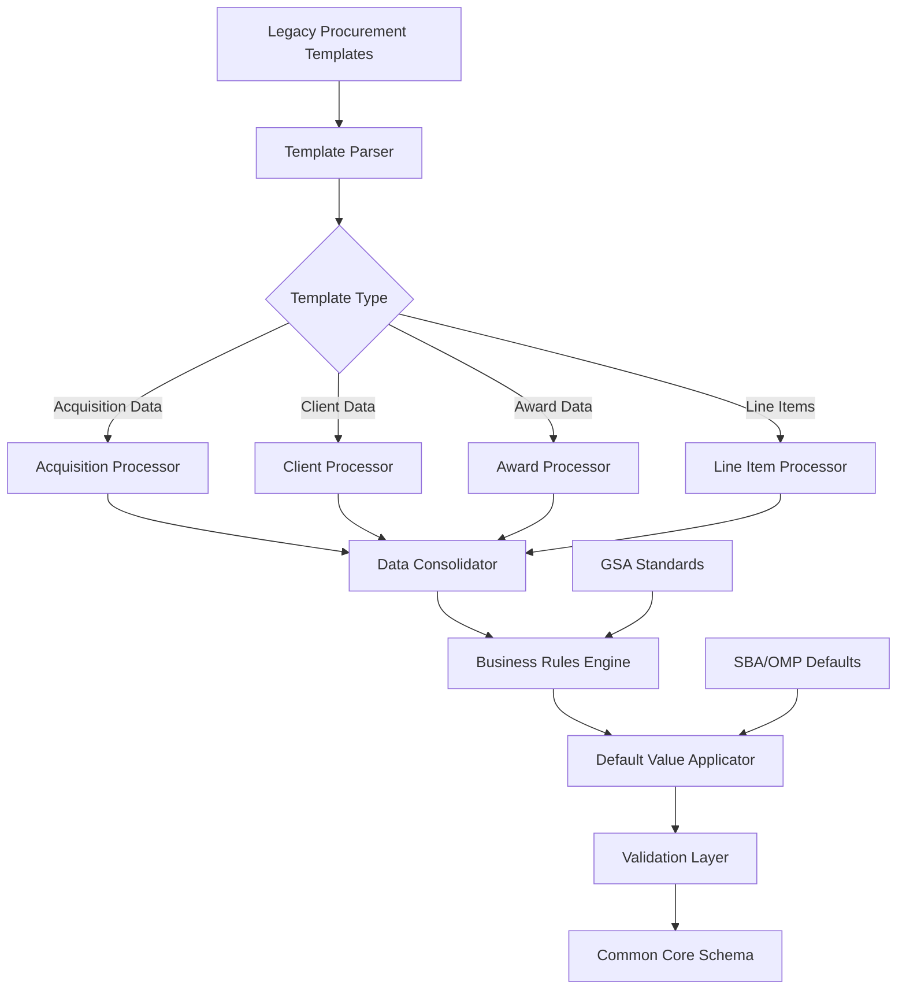

# Comprehensive Guide: Legacy Procurement to Common Core Schema Transformation

## Table of Contents

1. [Overview and Architecture](#overview)
2. [Schema Mapping Framework](#mapping-framework)
3. [Data Type Transformations](#data-types)
4. [Data Provenance and Lineage](#provenance)
5. [Complex Concept Handling](#complex-concepts)
6. [Template Processing Architecture](#template-processing)
7. [Business Rules and Default Handling](#business-rules)
8. [Quality Assurance and Validation](#quality-assurance)
9. [Implementation Guidelines](#implementation)

## 1. Overview and Architecture {#overview}

### 1.1 Legacy Procurement System Context

The Acquisition Services Support Information System Tool (Legacy Procurement) serves as GSA's primary system for managing interagency agreements and procurement templates. Unlike Contract Data's program-focused structure, Legacy Procurement operates through **template-based data collection** across multiple Excel spreadsheets that capture acquisition, client, and award information for federal contracting activities.

### 1.2 Key Legacy Procurement Characteristics

- **Template-Driven Architecture**: Data stored in structured Excel templates
- **Interagency Focus**: Manages relationships between GSA and requesting agencies
- **Transactional Processing**: Emphasizes individual contract actions vs. program management
- **Client-Centric Model**: Strong focus on requesting agency (client) information
- **Award Lifecycle Management**: Tracks contracts from acquisition through completion

### 1.3 Transformation Objectives

- **Template Consolidation**: Merge data from 8+ Legacy Procurement templates into unified structure
- **Agency Relationship Mapping**: Translate GSA-client relationships to standard organizational model
- **Default Value Application**: Handle missing data with business-appropriate defaults
- **Contract Lifecycle Normalization**: Standardize award states and processing stages
- **Interoperability Preparation**: Structure data for seamless EASi integration

### 1.4 Architecture Overview



## 2. Schema Mapping Framework {#mapping-framework}

### 2.1 Template-Based Mapping Strategy

Legacy Procurement transformation requires **multi-template aggregation** where related data from different Excel templates must be consolidated into single common core records.

#### Template Processing Order:

1. **Client Data Template** → Organization and contact information
2. **Acquisition Data Template** → Contract identification and performance location
3. **Award Base Data Template** → Financial and classification information
4. **Award Line Item Data** → Detailed pricing and CLIN information

### 2.2 Primary Mapping Table: Legacy Procurement to Common Core

| Common Core Field                             | Legacy Procurement Template Source | Template Field Path                        | Transformation Type | Business Rules                           |
| --------------------------------------------- | ---------------------------------- | ------------------------------------------ | ------------------- | ---------------------------------------- |
| `systemMetadata.primarySystem`                | Static                             | N/A                                        | Direct              | Always "Legacy Procurement"              |
| `systemMetadata.globalRecordId`               | Acquisition Data                   | `originalAwardPiid`                        | Prefixed            | "Legacy Procurement-" + PIID             |
| `contractIdentification.piid`                 | Acquisition Data                   | `originalAwardPiid`                        | Direct              | Must match across templates              |
| `contractIdentification.originalAwardPiid`    | Acquisition Data                   | `originalAwardPiid`                        | Direct              | Primary contract identifier              |
| `contractIdentification.referencedPiid`       | Acquisition Data                   | `iaPiidOrUniqueId`                         | Direct              | Interagency agreement ID                 |
| `contractIdentification.contractType`         | Award Base Data                    | `typeOfContract`                           | Lookup              | Map to standard contract types           |
| `organizationInfo.contractingAgency.code`     | Static/Derived                     | N/A                                        | Business Rule       | Always "047" (GSA)                       |
| `organizationInfo.contractingAgency.name`     | Static/Derived                     | N/A                                        | Business Rule       | Always "General Services Administration" |
| `organizationInfo.fundingAgency.code`         | Client Data                        | `agencyCode`                               | Direct              | Client agency becomes funding agency     |
| `organizationInfo.fundingAgency.name`         | Client Data                        | `clientOrganizationName`                   | Direct              | Client org becomes funding org           |
| `vendorInfo.vendorName`                       | Contractor Company Data            | `vendorName`                               | Direct              | From contractor template                 |
| `vendorInfo.vendorUei`                        | Contractor Company Data            | `vendorUei`                                | Direct              | Unique Entity Identifier                 |
| `placeOfPerformance.city`                     | Acquisition Data                   | `placeOfPerformance.city`                  | Direct              | Where work is performed                  |
| `placeOfPerformance.state`                    | Acquisition Data                   | `placeOfPerformance.state`                 | Direct              | Performance location state               |
| `placeOfPerformance.congressionalDistrict`    | Acquisition Data                   | `placeOfPerformance.congressionalDistrict` | Direct              | Political boundary data                  |
| `financialInfo.independentGovernmentEstimate` | Award Base Data                    | `independentGovernmentEstimate`            | Default Handling    | Default to 1.0 if missing                |
| `financialInfo.totalContractValue`            | Award Base Data                    | `totalContractValue`                       | Direct              | Total award value                        |
| `financialInfo.baseAndAllOptionsValue`        | Award Base Data                    | `baseAndAllOptionsValue`                   | Direct              | Base plus all options                    |
| `businessClassification.naicsCode`            | Award Base Data                    | `naicsCode`                                | Direct              | Industry classification                  |
| `businessClassification.pscCode`              | Award Base Data                    | `pscCode`                                  | Direct              | Product/service code                     |
| `businessClassification.setAsideType`         | Award Base Data                    | `setAsideType`                             | Enumeration         | Standardize set-aside categories         |
| `businessClassification.localAreaSetAside`    | Award Base Data                    | `setAsideForLocalFirms`                    | Boolean             | Local preference indicator               |

### 2.3 Template Cross-Reference Architecture

Legacy Procurement templates are linked through common identifiers that enable data consolidation:

```json
{
  "templateLinkage": {
    "primaryKey": "originalAwardPiid",
    "secondaryKeys": ["iaPiidOrUniqueId", "clientOrganizationName"],
    "templateRelationships": {
      "01_Acquisition_Data": {
        "provides": ["contractIdentification", "placeOfPerformance"],
        "requires": ["originalAwardPiid"],
        "links_to": ["02_Client_Data", "03_Award_Base_Data"]
      },
      "02_Client_Data": {
        "provides": ["organizationInfo", "contacts"],
        "requires": ["agencyCode", "clientOrganizationName"],
        "links_to": ["01_Acquisition_Data"]
      },
      "03_Award_Base_Data": {
        "provides": [
          "financialInfo",
          "businessClassification",
          "contractCharacteristics"
        ],
        "requires": ["originalAwardPiid"],
        "links_to": ["04_Award_Line_Item_Data"]
      }
    }
  }
}
```

### 2.4 Dot Notation Field References with Template Context

```json
// Legacy Procurement Template Structure Example
{
  "01_Acquisition_Data_Template": {
    "originalAwardPiid": "47QSWA20D0001",
    "iaPiidOrUniqueId": "IA-SBA-2024-001",
    "natureOfAcquisition": "ADMIN_CONTINUE_TRANSFER",
    "placeOfPerformance": {
      "city": "Washington",
      "state": "DC",
      "zip": "20405",
      "congressionalDistrict": "DC-00"
    }
  },
  "02_Client_Data_Template": {
    "agencyCode": "073-00",
    "clientOrganizationName": "Small Business Administration",
    "officeAddress": {
      "streetAddress1": "409 3rd Street SW",
      "city": "Washington",
      "state": "DC"
    }
  }
}

// Common Core Mapping with Template References
{
  "contractIdentification": {
    "piid": "01_Acquisition_Data.originalAwardPiid",
    "referencedPiid": "01_Acquisition_Data.iaPiidOrUniqueId"
  },
  "organizationInfo": {
    "fundingAgency": {
      "code": "02_Client_Data.agencyCode",
      "name": "02_Client_Data.clientOrganizationName"
    }
  },
  "placeOfPerformance": {
    "city": "01_Acquisition_Data.placeOfPerformance.city",
    "state": "01_Acquisition_Data.placeOfPerformance.state"
  }
}
```

## 3. Data Type Transformations {#data-types}

### 3.1 Template-Specific Type Handling

| Legacy Procurement Template Type | Common Core Type     | Transformation Rule              | Validation Requirements            |
| -------------------------------- | -------------------- | -------------------------------- | ---------------------------------- |
| Excel String Cell                | `string`             | Trim whitespace, null check      | Non-empty for required fields      |
| Excel Number Cell                | `decimal`            | Parse with precision handling    | Range validation for financial     |
| Excel Date Cell                  | `string (date-time)` | ISO 8601 conversion              | Valid date format                  |
| Excel Boolean Cell               | `boolean`            | Excel true/false to JSON boolean | Handle Yes/No, Y/N variations      |
| Excel Formula Cell               | Calculated type      | Evaluate formula result          | Recalculate if dependencies change |
| Dropdown List                    | `enum`               | Validate against allowed values  | Must match template constraints    |

### 3.2 Complex Type Processing

#### 3.2.1 Address Standardization

```json
// Legacy Procurement Template Address Format
{
  "clientData": {
    "officeAddress": {
      "streetAddress1": "409 3rd Street SW",
      "streetAddress2": "",
      "city": "Washington",
      "state": "DC",
      "zip": "20024"
    }
  }
}

// Common Core Transformation
{
  "placeOfPerformance": {
    "streetAddress": "409 3rd Street SW",  // Combine address lines
    "city": "Washington",
    "state": "DC",
    "zip": "20024",
    "country": "USA"  // Default for domestic contracts
  }
}
```

#### 3.2.2 Financial Data Aggregation

```json
// Legacy Procurement Award Line Item Template
{
  "lineItems": [
    {
      "clinNumber": "0001",
      "unitPrice": 150.00,
      "quantity": 1000,
      "extendedAmount": 150000.00
    },
    {
      "clinNumber": "0002",
      "unitPrice": 200.00,
      "quantity": 500,
      "extendedAmount": 100000.00
    }
  ]
}

// Common Core Financial Aggregation
{
  "financialInfo": {
    "totalContractValue": 250000.00,  // Sum of all extended amounts
    "amountSpentOnProduct": 250000.00,  // Current obligation total
    "contractFiscalYear": "2024"  // Derived from contract dates
  }
}
```

### 3.3 Enumeration Standardization

#### 3.3.1 Contract Type Mapping

```yaml
legacy_procurement_contract_types:
  "J - Firm Fixed Priced": "FFP"
  "T - Time and Materials": "T&M"
  "Z - Cost Plus Fixed Fee": "CPFF"
  "1-Order Dependent": "IDIQ"
  "K - Cost No Fee": "CNF"

common_core_contract_types: ["FFP", "T&M", "CPFF", "IDIQ", "CNF", "Other"]
```

#### 3.3.2 Set-Aside Type Standardization

```yaml
legacy_procurement_set_aside_mapping:
  "Small Business Set-Aside": "SB"
  "8(a) Business Development": "8A"
  "Service-Disabled Veteran-Owned Small Business": "SDVOSB"
  "Women-Owned Small Business": "WOSB"
  "HUBZone Small Business": "HUBZONE"
  "No Set Aside Used": "OPEN"
```

## 4. Data Provenance and Lineage {#provenance}

### 4.1 Multi-Template Provenance Tracking

```json
{
  "systemMetadata": {
    "systemChain": [
      {
        "systemName": "Logistics Mgmt",
        "recordId": "Logistics Mgmt-SBA-001-2024",
        "processedDate": "2024-01-10T09:00:00Z",
        "transformationRules": [
          "logistics_mgmt_to_legacy_procurement_mapping",
          "sba_client_defaults"
        ],
        "sourceTemplates": ["SBA_Legacy_Export.xlsx"],
        "dataQuality": {
          "completenessScore": 0.72,
          "validationErrors": ["Missing IGE amount"],
          "lastValidated": "2024-01-10T09:00:00Z"
        }
      },
      {
        "systemName": "Legacy Procurement",
        "recordId": "Legacy Procurement-GSA-001-2024",
        "processedDate": "2024-01-12T14:30:00Z",
        "transformationRules": [
          "legacy_procurement_template_processing",
          "gsa_interagency_defaults"
        ],
        "sourceTemplates": [
          "01_GSA_Acquisition_Template_Acquisition_Data.xlsx",
          "02_GSA_Acquisition_Template_Client_Data.xlsx",
          "03_GSA_Acquisition_Template_Award_Base_In_Process_Data.xlsx"
        ],
        "dataQuality": {
          "completenessScore": 0.85,
          "validationErrors": [],
          "lastValidated": "2024-01-12T14:30:00Z"
        }
      }
    ]
  }
}
```

### 4.2 Template-Level Lineage Tracking

Each field maintains reference to its source template and cell location:

```json
{
  "fieldProvenance": {
    "contractIdentification.piid": {
      "sourceTemplate": "01_GSA_Acquisition_Template_Acquisition_Data.xlsx",
      "worksheetName": "Acquisition_Data",
      "cellLocation": "B2",
      "fieldName": "Original Award PIID",
      "dataType": "string",
      "transformationApplied": "direct_copy",
      "validationRules": ["piid_format_validation", "uniqueness_check"],
      "confidence": 1.0
    },
    "organizationInfo.fundingAgency.code": {
      "sourceTemplate": "02_GSA_Acquisition_Template_Client_Data.xlsx",
      "worksheetName": "Client_Data",
      "cellLocation": "C4",
      "fieldName": "Agency Code - Bureau Code",
      "dataType": "string",
      "transformationApplied": "agency_code_standardization",
      "validationRules": ["agency_code_lookup"],
      "confidence": 0.95,
      "notes": "Validated against official agency code registry"
    }
  }
}
```

### 3.3 Cross-Template Data Validation

Template relationships enable cross-validation:

```json
{
  "crossTemplateValidation": {
    "contractIdentification.piid": {
      "primarySource": "01_Acquisition_Data.originalAwar
```
