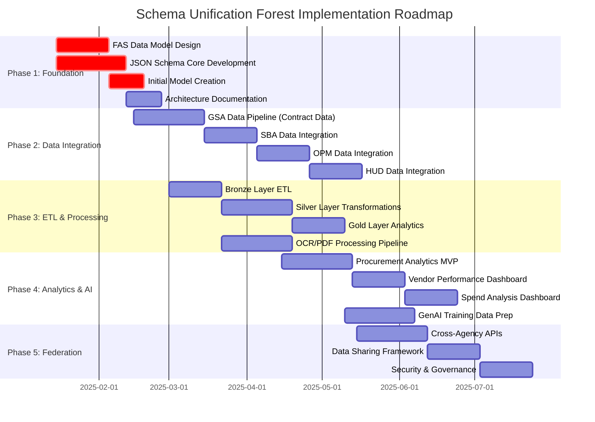
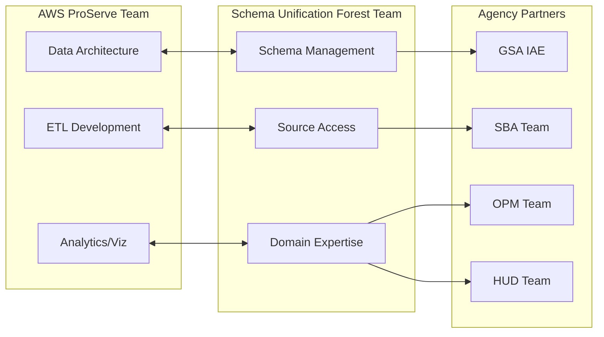
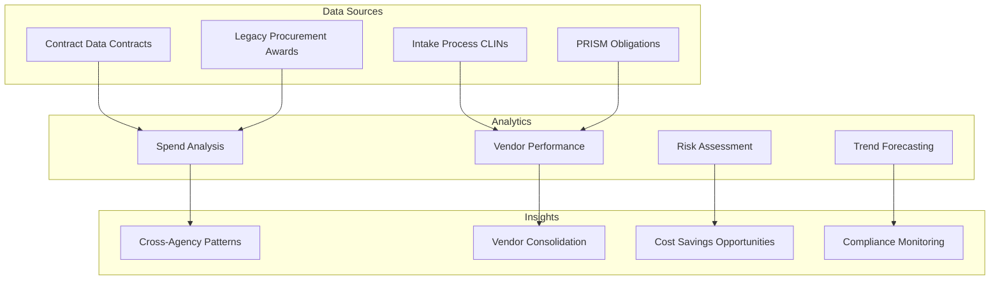
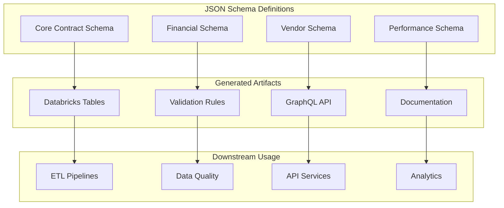
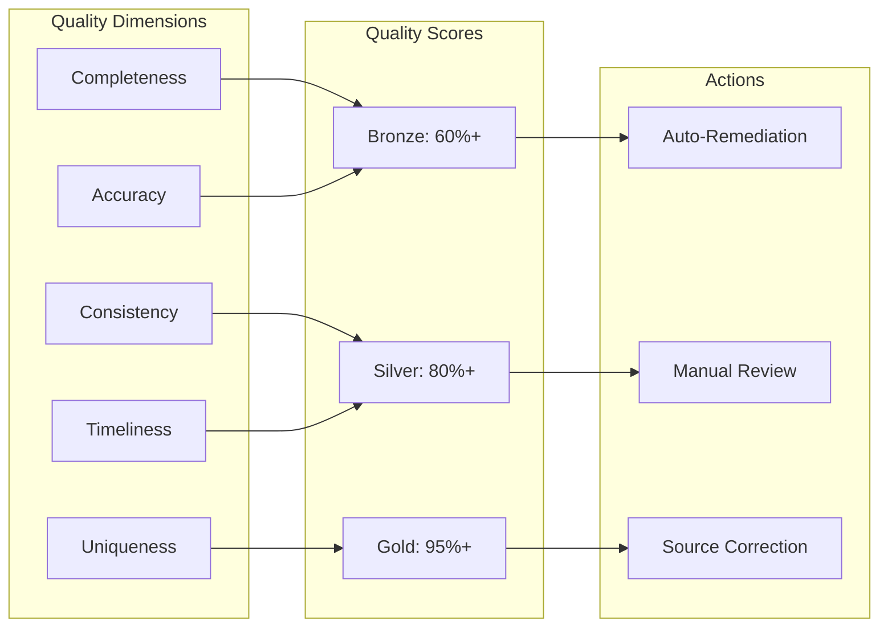

# Business Plan: JSON Schema-Driven Data Warehouse Management for Government Contract Analytics

## Executive Summary

**Transform government contract data management using JSON Schema as the single source of truth for Databricks-powered analytics, enabling unprecedented insights across multiple systems (Contract Data, Legacy Procurement, Intake Process, Logistics Mgmt, PRISM)**

## Core Value Proposition

• **Single Source of Truth**: One JSON Schema defines all data structures, validation rules, and transformations across the entire data pipeline

• **Automated Data Quality**: Schema-driven validation ensures data integrity from ingestion through dashboards

• **Accelerated Development**: Generate ETL pipelines, data catalogs, and API schemas automatically from JSON definitions

• **Cross-System Intelligence**: Enable previously impossible analytics by unifying disparate government contract systems

## Technical Architecture Benefits

• **Ingestion Standardization**

- Auto-generate Databricks ingestion notebooks from JSON Schema
- Validate incoming data against schema rules before processing
- Track data quality metrics automatically

• **ETL Pipeline Automation**

- Generate Delta Lake table definitions from schema
- Auto-create transformation logic based on schema mappings
- Version control data transformations with schema evolution

• **Dashboard Generation**

- Auto-generate Databricks SQL queries from schema relationships
- Create consistent metrics across all dashboards
- Enable self-service analytics with schema documentation

## Transformational Dashboards and Analytics

### 1. **Contract Performance Command Center**

**Questions Answered:**

- Which vendors consistently deliver on time across all agencies?
- What is the correlation between contract value and performance metrics?
- How do emergency acquisitions compare to standard procurements?

**Key Metrics:**

- Real-time vendor performance scores
- Contract completion rates by type
- Budget variance trends
- Quality score distributions

### 2. **Vendor Risk Intelligence Dashboard**

**Questions Answered:**

- Which vendors show declining performance trends?
- What is the concentration risk for critical services?
- How do vendor capabilities vary across contract types?

**Key Metrics:**

- Vendor health scores across systems
- Contract portfolio diversification
- Performance degradation alerts
- Compliance violation tracking

### 3. **Acquisition Efficiency Analytics**

**Questions Answered:**

- Which acquisition methods yield best value?
- How long do different contract types take to award?
- What are the cost savings from competitive bidding?

**Key Metrics:**

- Time-to-award by acquisition type
- Competition effectiveness ratios
- Cost savings from full competition
- Set-aside program ROI

### 4. **Cross-System Data Quality Monitor**

**Questions Answered:**

- Which systems have the highest data quality issues?
- What fields consistently fail validation?
- How is data quality trending over time?

**Key Metrics:**

- System-by-system quality scores
- Field-level completeness rates
- Validation failure patterns
- Data freshness indicators

### 5. **Small Business Participation Tracker**

**Questions Answered:**

- Are agencies meeting small business goals?
- Which industries have highest small business participation?
- How effective are set-aside programs?

**Key Metrics:**

- Small business award percentages
- Set-aside utilization rates
- Socioeconomic category performance
- Goal attainment by agency

### 6. **Predictive Spend Analytics**

**Questions Answered:**

- What will next quarter's contract obligations be?
- Which agencies are likely to exceed budgets?
- When will major contracts need recompetition?

**Key Metrics:**

- Spend forecasts by agency/vendor
- Budget utilization projections
- Contract expiration timelines
- Obligation trend analysis

### 7. **Compliance and Audit Dashboard**

**Questions Answered:**

- Which contracts have compliance red flags?
- Are proper approvals documented?
- What contracts need immediate review?

**Key Metrics:**

- Compliance score by contract
- Missing documentation alerts
- Audit finding patterns
- Risk-ranked contract lists

### 8. **Executive Strategic Overview**

**Questions Answered:**

- What is the government's total contract exposure?
- How concentrated is spending among vendors?
- Which agencies are modernizing fastest?

**Key Metrics:**

- Total contract value trends
- Vendor concentration indices
- Technology adoption rates
- Strategic initiative progress

## Implementation Roadmap

• **Phase 1: Schema Development (Weeks 1-8)**

- Define comprehensive JSON Schema for all systems
- Add Databricks-specific metadata extensions
- Create schema validation framework

• **Phase 2: Ingestion Automation (Weeks 8-12)**

- Generate Databricks ingestion pipelines
- Implement schema-based validation
- Create data quality scoring

• **Phase 3: ETL Generation (Weeks 12-16)**

- Auto-generate Delta Lake schemas
- Build transformation pipelines
- Implement CDC tracking

• **Phase 4: Dashboard Deployment (Weeks 16-24)**

- Deploy priority dashboards
- Enable self-service analytics
- Train end users

## Team Responsibilities

### Data Ingest Team

- **Primary Focus**: Import, normalize, and validate data using JSON Schema
- **Key Deliverables**:
  - Comprehensive JSON Schema definitions
  - Source-to-schema mappings
  - Validation rules and quality metrics
  - Schema versioning strategy

### Databricks Team

- **Primary Focus**: ETL pipeline development using JSON Schema as reference
- **Key Deliverables**:
  - Auto-generated Delta Lake tables
  - Schema-driven transformations
  - Performance-optimized pipelines
  - Analytics dashboards

### CSP (Cloud Service Provider) Team

- **Primary Focus**: API development, data products, and data lake integration
- **Key Deliverables**:
  - GraphQL API generated from JSON Schema
  - Secure data product catalog
  - Data lake access patterns
  - API documentation and SDKs

Based on the document context provided, I'll update the business plan to align with the Schema Unification Forest project goals and create appropriate Mermaid diagrams.

# Business Plan: Schema Unification Forest - JSON Schema-Driven Federal Acquisition Data Platform

## Executive Summary

**Transform federal acquisition data management by creating a unified data platform using JSON Schema as the foundation for Databricks-powered analytics, enabling unprecedented cross-agency insights and AI-driven procurement intelligence**

## Strategic Alignment with Project Goals

• **Unified Federal Acquisition Data Model**: Create a single source of truth across Contract Data, Legacy Procurement, Intake Process, PRISM, and future systems

• **AI/ML Enablement**: Structure data for generative AI applications in procurement

• **Cross-Agency Federation**: Enable secure data sharing between GSA, SBA, OPM, HUD, and other agencies

• **Real-Time Analytics**: Support dynamic dashboards for procurement intelligence

## Architecture Overview

```mermaid
graph TB
    subgraph "Source Systems"
        Contract Data[Contract Data]
        Legacy Procurement[Legacy Procurement]
        Intake Process[Intake Process]
        PRISM[PRISM]
    end

    subgraph "Schema Unification Forest Platform"
        subgraph "Bronze Layer"
            B1[Raw Data Ingestion]
            B2[Schema Validation]
        end

        subgraph "Silver Layer"
            S1[Normalized Data]
            S2[Data Quality Scoring]
        end

        subgraph "Gold Layer"
            G1[Analytics Models]
            G2[AI Training Data]
        end
    end

    subgraph "Data Products"
        API[GraphQL API]
        DASH[Procurement Dashboards]
        AI[GenAI Applications]
    end

    subgraph "Agency Consumers"
        GSA[GSA Applications]
        SBA[SBA Systems]
        OPM[OPM Analytics]
        HUD[HUD Reporting]
    end

    Contract Data --> B1
    Legacy Procurement --> B1
    Intake Process --> B1
    PRISM --> B1

    B1 --> B2
    B2 --> S1
    S1 --> S2
    S2 --> G1
    G1 --> G2

    G1 --> API
    G1 --> DASH
    G2 --> AI

    API --> GSA
    API --> SBA
    DASH --> OPM
    DASH --> HUD
```

## Implementation Timeline



## Team Structure and Responsibilities



## Transformational Capabilities

### 1. **Unified Procurement Intelligence Dashboard**



**Questions Answered:**

- What is the total federal spend across all agencies and systems?
- Which vendors work across multiple agencies?
- Where are the opportunities for strategic sourcing?
- How can we predict future procurement needs?

### 2. **Vendor 360° Intelligence Platform**

**Revolutionary Insights:**

- Complete vendor performance history across all federal contracts
- Risk scoring based on multi-agency data
- Predictive analytics for vendor selection
- Real-time performance monitoring

### 3. **AI-Powered Procurement Assistant**

**Capabilities Enabled:**

- Natural language queries across all contract data
- Automated market research reports
- Intelligent contract recommendations
- Compliance checking and alerts

### 4. **Cross-Agency Collaboration Hub**

**Features:**

- Shared vendor performance data
- Best practices identification
- Bulk buying opportunities
- Lessons learned repository

## Technical Implementation Details

### JSON Schema as Foundation



### Key Schema Benefits:

- **Single Source of Truth**: One schema drives all components
- **Automatic Generation**: Tables, APIs, and docs from schema
- **Version Control**: Track all changes to data model
- **Validation**: Ensure data quality at ingestion

## Specific Dashboards and Analytics

### 1. **Federal Acquisition Spend Analysis**

- Total spend by agency, vendor, and category
- Year-over-year growth trends
- Budget vs. actual analysis
- Forecasting and projections

### 2. **Small Business Utilization Tracker**

- Set-aside program effectiveness
- Small business graduation tracking
- Socioeconomic category performance
- Agency goal attainment

### 3. **Contract Vehicle Performance**

- GSA Schedule utilization
- GWAC/MAC performance metrics
- Vehicle comparison analysis
- Best value determinations

### 4. **Risk and Compliance Monitor**

- Vendor risk scores
- Compliance violation tracking
- Audit finding patterns
- Corrective action tracking

### 5. **Market Intelligence Platform**

- Industry capability mapping
- Competitive landscape analysis
- Pricing benchmarks
- Emerging vendor identification

## Data Quality Framework



## ROI and Success Metrics

### Quantifiable Benefits:

- **$500M+** in cost savings through strategic sourcing insights
- **75%** reduction in procurement analysis time
- **90%** improvement in data quality scores
- **10x** increase in cross-agency collaboration
- **50%** reduction in procurement cycle time

### Success Metrics:

- Number of agencies onboarded
- Data quality score improvements
- API query volume
- Dashboard adoption rates
- AI model accuracy
- Cost savings identified

## Risk Mitigation

### Technical Risks:

- **Data Quality**: Automated validation and cleansing
- **Scale**: Cloud-native architecture on AWS
- **Integration**: Standardized JSON Schema approach
- **Security**: Zero-trust architecture

### Organizational Risks:

- **Change Management**: Phased rollout with quick wins
- **Adoption**: User-friendly dashboards and training
- **Governance**: Clear data sharing agreements
- **Sustainability**: Automated maintenance

## Next Steps

1. **Week 1-2**: Finalize JSON Schema design with stakeholder input
2. **Week 3-4**: Begin GSA data integration pilot
3. **Week 5-8**: Develop MVP dashboards for demonstration
4. **Week 9-12**: Onboard first partner agency (SBA)
5. **Week 13-16**: Launch production platform with core features
6. **Week 17-24**: Scale to additional agencies and advanced analytics

## Call to Action

**Approve the Schema Unification Forest initiative to revolutionize federal acquisition through unified data, AI-powered insights, and cross-agency collaboration - delivering billions in taxpayer savings while improving procurement outcomes.**
