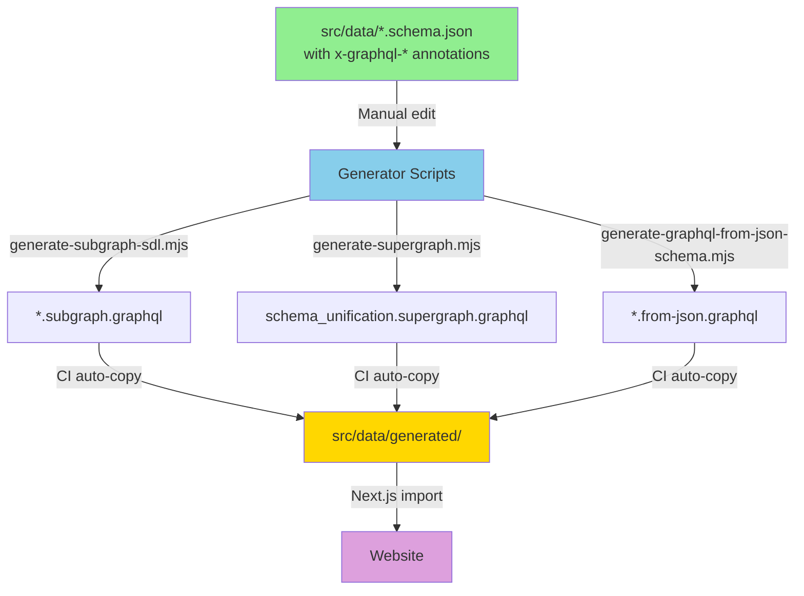
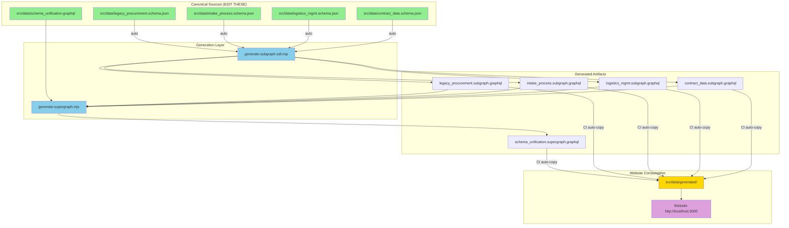

# Schema Architecture Guide

## 🎯 Executive Summary

**Current Reality (December 2025)**: JSON Schemas with x-graphql-* annotations are the single source of truth. All GraphQL SDL is generated from these schemas.

**Architecture**: Canonical JSON Schemas per system → Generator scripts → Federation-ready GraphQL SDL → CI auto-publishes for website consumption.

---

## 📂 Schema Landscape (Current Reality)

### Source Schemas (`src/data/`) - **Edit These**

| File | Purpose | Status | Case Convention |
|------|---------|--------|-----------------|
| `schema_unification.schema.json` | Unified supergraph schema with all systems | ✅ **CANONICAL** | snake_case |
| `contract_data.schema.json` | Contract Data system subgraph with x-graphql hints | ✅ **CANONICAL** | snake_case |
| `legacy_procurement.schema.json` | Legacy Procurement system subgraph with x-graphql hints | ✅ **CANONICAL** | snake_case |
| `intake_process.schema.json` | EASi system subgraph with x-graphql hints | ✅ **CANONICAL** | snake_case |
| `logistics_mgmt.schema.json` | Logistics Mgmt system subgraph with x-graphql hints | ✅ **CANONICAL** | snake_case |
| `public_spending.schema.json` | Public Spending system subgraph with x-graphql hints | ✅ **CANONICAL** | snake_case |

### Generated Artifacts (`generated-schemas/`) - **Auto-Generated**

| File | Generated From | Purpose | Keep? |
|------|----------------|---------|-------|
| `schema_unification.from-json.graphql` | `schema_unification.schema.json` | SDL from JSON Schema | ✅ Yes (validation) |
| `contract_data.subgraph.graphql` | `contract_data.schema.json` | Contract Data federation subgraph | ✅ Yes |
| `legacy_procurement.subgraph.graphql` | `legacy_procurement.schema.json` | Legacy Procurement federation subgraph | ✅ Yes |
| `legacy_procurement.from-json.graphql` | `legacy_procurement.schema.json` | SDL from JSON Schema | ✅ Yes (validation) |
| `intake_process.subgraph.graphql` | `intake_process.schema.json` | EASi federation subgraph | ✅ Yes |
| `intake_process.from-json.graphql` | `intake_process.schema.json` | SDL from JSON Schema | ✅ Yes (validation) |
| `logistics_mgmt.subgraph.graphql` | `logistics_mgmt.schema.json` | Logistics Mgmt federation subgraph | ✅ Yes |
| `logistics_mgmt.from-json.graphql` | `logistics_mgmt.schema.json` | SDL from JSON Schema | ✅ Yes (validation) |
| `public_spending.subgraph.graphql` | `public_spending.schema.json` | Public Spending federation subgraph | ✅ Yes |
| `schema_unification.supergraph.graphql` | All `*.subgraph.graphql` | Composed supergraph | ✅ Yes (federation) |
| `field-name-mapping.json` | Auto-generated | camelCase ↔ snake_case | ✅ Yes (validation) |

### Website Consumption (`src/data/generated/`) - **CI Auto-Populated**

This directory is a mirror of `generated-schemas/` for direct Next.js imports.

**Do NOT manually edit.** All files automatically copied by CI workflows.

### Legacy Files (`src/data/archived/`) - **Reference Only**

| File | Reason Archived | Date |
|------|----------------|------|
| `schema_unification.graphql` | Superseded by x-graphql annotations in JSON Schema | Dec 2025 |

---

## 🔄 Actual Data Flow (Current Reality - December 2025)



**Key Points:**

- ✅ JSON Schema with x-graphql-* annotations is single source of truth
- ✅ All GraphQL SDL is generated (not manually edited)
- ✅ CI automatically copies generated files to `src/data/generated/`
- ✅ Website directly imports from `src/data/generated/`
- ✅ Snake_case in JSON Schema → camelCase in GraphQL SDL (automatic conversion)

---

## ✅ Refactored Architecture (Target State)

### Single Source of Truth Per System

```plaintext
src/data/
├── schema_unification.schema.json          ← SUPERGRAPH canonical (unified schema)
├── contract_data.schema.json               ← Contract Data subgraph with x-graphql annotations
├── legacy_procurement.schema.json             ← Legacy Procurement subgraph with x-graphql annotations
├── intake_process.schema.json               ← Intake Process subgraph with x-graphql annotations
├── logistics_mgmt.schema.json               ← Logistics Mgmt subgraph with x-graphql annotations
├── public_spending.schema.json        ← Public Spending subgraph with x-graphql annotations
├── archived/                      ← Legacy files (reference only)
│   └── schema_unification.graphql          ← Superseded by x-graphql annotations
└── generated/                     ← CI auto-populated (do not edit)
    ├── README.md                  ← "Auto-generated by CI"
    └── *.subgraph.graphql         ← Federation-ready SDL
```

### One Generator Per Purpose

| Script | Input | Output | Purpose |
|--------|-------|--------|---------|
| `generate-subgraph-sdl.mjs` | `{system}.schema.json` | `{system}.subgraph.graphql` | Federation subgraphs |
| `generate-supergraph.mjs` | All `*.subgraph.graphql` | `schema_unification.supergraph.graphql` | Compose federation |
| `generate-schema-interop.mjs` | `schema_unification.graphql` + `schema_unification.schema.json` | Validation artifacts | Parity checks |

### Clean Data Flow



---

## 🛠️ Refactoring Plan

### Phase 1: Consolidate Generators (Week 1)

- [ ] **Consolidate**: Merge `generate-graphql-enhanced.mjs` and `generate-graphql-from-json-schema.mjs` into single `generate-subgraph-sdl.mjs`
- [ ] **Purpose**: One script that reads `{system}.schema.json` (with x-graphql hints) and outputs `{system}.subgraph.graphql`
- [ ] **Test**: Ensure Legacy Procurement, EASi, Logistics Mgmt subgraphs generate correctly

### Phase 2: Federation Composer (Week 1)

- [ ] **Create**: `generate-supergraph.mjs` that composes all `*.subgraph.graphql` files
- [ ] **Use**: Apollo Federation or GraphQL Mesh composition
- [ ] **Output**: `schema_unification.supergraph.graphql` (replaces `schema_unification.omnigraph.graphql`)

### Phase 3: Extract Contract Data Subgraph (Week 2)

- [ ] **Extract**: Contract Data-specific types from `schema_unification.schema.json` into `contract_data.schema.json`
- [ ] **Rationale**: Contract Data should be a subgraph like Legacy Procurement/EASi/Logistics Mgmt, not baked into supergraph
- [ ] **Update**: `schema_unification.schema.json` becomes composition config, not data schema

### Phase 4: Clean Generated Files (Week 2)

- [ ] **Archive**: Move `*.v1-custom.graphql`, `*.v2-custom.graphql` to `dev/archived/`
- [ ] **Remove**: `debug.from-json.graphql`, `prism.from-json.graphql`, `roundtrip.temp.*`
- [ ] **Keep**: Only `*.subgraph.graphql` and `schema_unification.supergraph.graphql`

### Phase 5: Automate Publishing (Week 2)

- [ ] **Update**: CI workflow to run subgraph + supergraph generation
- [ ] **Auto-copy**: Generated files to `src/data/generated/` and `public/data/`
- [ ] **Validate**: Ensure website imports work correctly

---

## 📋 Developer Workflow (After Refactor)

### Edit Legacy Procurement Schema

```bash
# 1. Edit canonical Legacy Procurement schema
vim src/data/legacy_procurement.schema.json

# 2. Validate
pnpm run validate:schema

# 3. Generate Legacy Procurement subgraph SDL
node scripts/generate-subgraph-sdl.mjs src/data/legacy_procurement.schema.json

# 4. Compose supergraph
node scripts/generate-supergraph.mjs

# 5. Publish (auto-copies to website dirs)
./scripts/publish-generated.sh

# 6. Preview
pnpm dev
# Visit http://localhost:3000/legacy_procurement-viewer
```

### Federation Workflow

```bash
# Generate all subgraphs from canonical schemas
pnpm run generate:subgraphs
# → legacy_procurement.subgraph.graphql
# → intake_process.subgraph.graphql
# → logistics_mgmt.subgraph.graphql
# → contract_data.subgraph.graphql

# Compose into supergraph
pnpm run generate:supergraph
# → schema_unification.supergraph.graphql

# Validate federation
pnpm run validate:federation
```

---

## 🎯 Benefits After Refactor

| Before | After |
|--------|-------|
| 5+ generator scripts | 2 main scripts |
| 20+ generated files | 5 subgraphs + 1 supergraph |
| Manual file copying | CI auto-publishes |
| Unclear "official" schema | One canonical per system |
| Mixed v1/v2/enhanced variants | Single versioned approach |
| Hard to trace provenance | Clear lineage: canonical → subgraph → supergraph |

---

## 📚 Related Documentation

- [x-graphql Hints Guide](./x-graphql-hints-guide.md) - How to annotate schemas for SDL generation
- [Schema Sync Guide](./schema-sync-guide.md) - Validation and parity checks
- [Testing Quick Reference](./testing-quick-reference.md) - Schema testing patterns

---

## 🚨 Migration Checklist

### For Each System (Legacy Procurement, EASi, Logistics Mgmt)

- [ ] Verify `src/data/{system}.schema.json` has all required x-graphql hints
- [ ] Run new `generate-subgraph-sdl.mjs` on system schema
- [ ] Compare output with existing `.from-json.graphql` and `.enhanced.graphql`
- [ ] Update any tests/imports pointing to old generated files
- [ ] Archive old variants (`*.v1-custom.graphql`, etc.)

### For Schema Unification Supergraph

- [ ] Extract Contract Data types into `contract_data.schema.json`
- [ ] Update `schema_unification.schema.json` to reference subgraphs (not define all types)
- [ ] Test supergraph composition with all 4 subgraphs
- [ ] Update website imports to use new file names

### For CI/CD

- [ ] Update `.github/workflows/schema-validation.yml` to run new generators
- [ ] Add auto-publish step for `src/data/generated/` and `public/data/`
- [ ] Update README with new workflow commands

---

## ❓ FAQ

**Q: Do we still need `schema_unification.graphql` (the SDL file)?**  
A: Yes, but its role changes. It should define root Query/Mutation/Subscription operations and federation configuration, not domain types. Domain types come from subgraphs.

**Q: What about the V2 schemas with x-graphql hints?**  
A: All canonical schemas (`legacy_procurement.schema.json`, etc.) should have x-graphql hints. No separate "v2" variants needed.

**Q: Can I still use `schema_unification.schema.json` for validation?**  
A: Yes, but it should validate against composed supergraph, not define all types itself. Think of it as a federation config + validation target.

**Q: What happens to `field-name-mapping.json`?**  
A: Keep it! Still needed for camelCase ↔ snake_case mapping in validators.

**Q: Should each system have its own GraphQL endpoint?**  
A: That's a deployment decision. Federation allows both: single gateway or separate services. Schemas support either approach.

---

**Last Updated**: December 2024  
**Status**: 🚧 Proposal - Awaiting approval to begin refactor
