# Schema Unification Forest

## Federal Procurement Data Fabric

A canonical data model for integrating, validating, and analyzing contract data across federal systems supporting the Federal Procurement Data Fabric.

GSA Technology Transformation Services | December 2025

---

# The Problem: Heterogeneous Federal Acquisition Data

Federal acquisition data is managed via multiple legacy systems and frameworks:

## Current Landscape

- **Contract Data** - Federal Procurement Data System
- **Legacy Procurement** - Automated Source Selection & Seller Intelligence  
- **EASi** - Enterprise Architecture Service Integration
- **Logistics Mgmt** - PRISM Contract Acquisition Management
- **Public Spending** - Public contract reporting
- **Entity Management.gov** - System for Award Management
- **Plus many more...** - PRISM, Momentum, Oracle CLM, Appian, AWS Quicksite, homegrown solutions

## The Challenge

Each system uses different data frameworks, naming conventions, and data structures making government-wide acquisition intelligence difficult.

---

# Federal Procurement Data Fabric Initiative

## IAE's Vision: Centralized Source of Truth

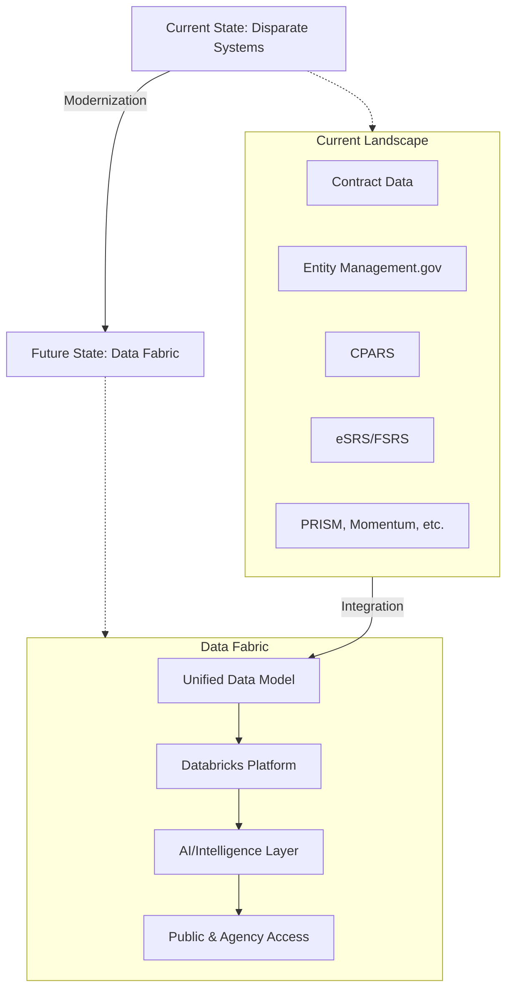

---

# The Solution: Schema-Driven Design

## JSON Schema as Source of Truth

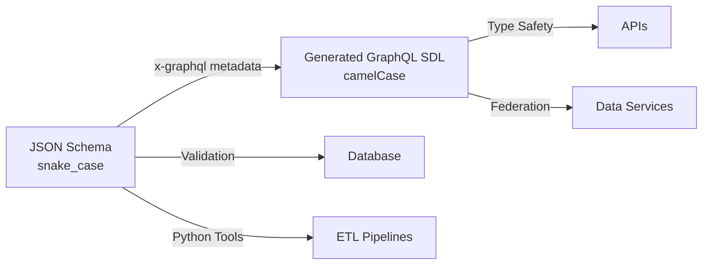

---

# Why JSON Schema First?

## Advantages Over GraphQL SDL

| Aspect | JSON Schema | GraphQL SDL |
|--------|------------|------------|
| **Validation** | Rich, native constraints | Limited validation |
| **Python Support** | First-class citizen | GraphQL tooling centric |
| **Database Alignment** | Direct column mapping | Indirect mapping |
| **Metadata** | x-graphql-* extensions | Graph structure only |
| **Constraints** | Min/max, patterns, enums | Type system only |

---

# Schema Unification Forest: Unified Schema

## 6 System Schemas in One Model

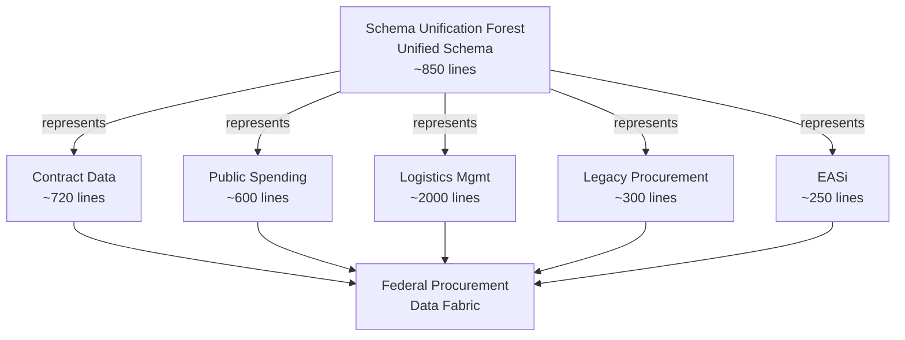

---

# Generation Pipeline

## From JSON to GraphQL

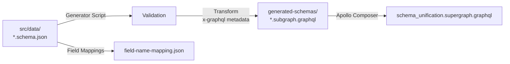

---

# Generated Artifacts

## What Gets Created

- **Subgraphs** - One per system (Contract Data, Legacy Procurement, EASi, Logistics Mgmt, Public Spending, Schema Unification)
- **Supergraph** - Federation of all subgraphs
- **Field Mappings** - JSON to GraphQL name conversions
- **Schema Diffs** - Validation of parity between JSON and GraphQL
- **Documentation** - Auto-generated from schema metadata

---

# Five-Step Development Workflow

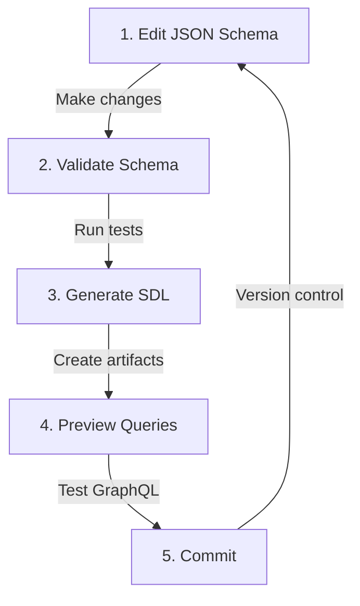

---

# Bidirectional Conversion

## JSON ↔ GraphQL Parity

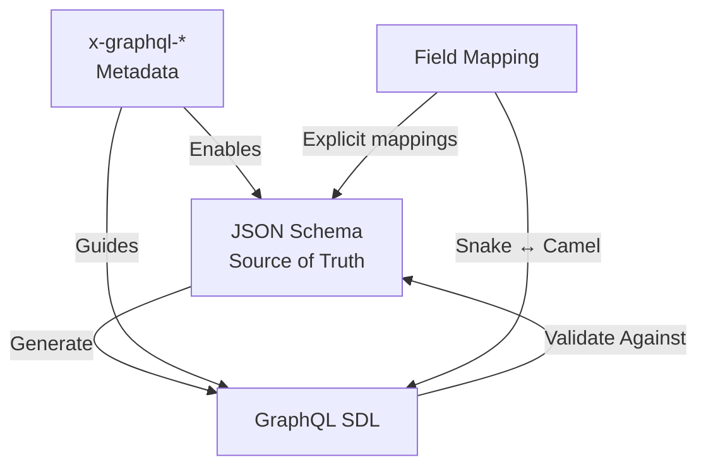

### Conversion Rules

- **Automatic**: `contract_id` → `contractId`, `vendor_name` → `vendorName`
- **Explicit**: `x-graphql-field-name` overrides for truncated fields (Public Spending)
- **Type Mapping**: `x-graphql-field-type` for DateTime, Decimal conversions
- **Directives**: `x-graphql-type-directives` for federation hints

---

# x-graphql-* Metadata System

## Extension Hints for Generation

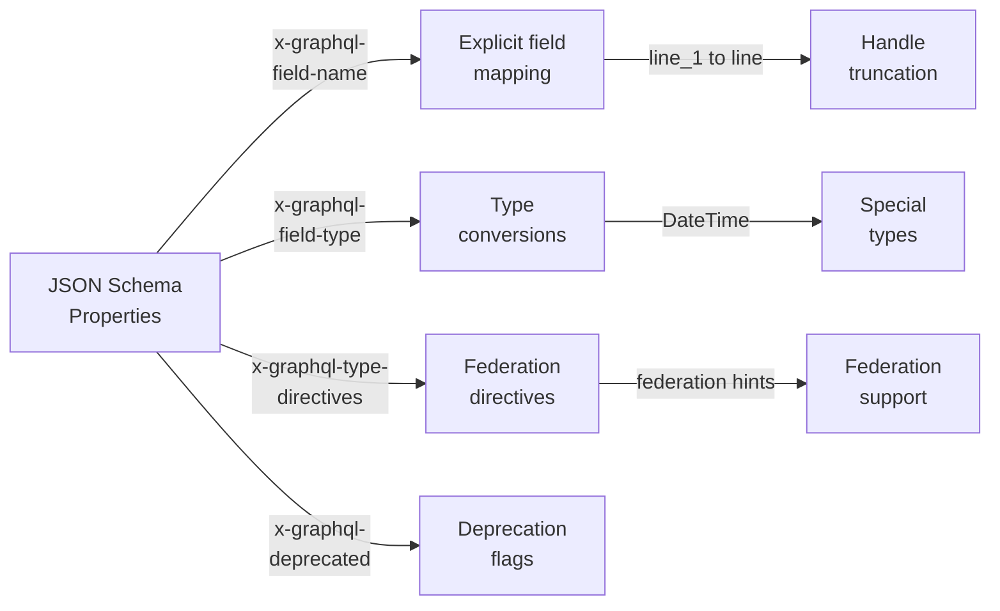

---

# Architectural Decision Records

## 9 ADRs Guide Development

1. [**ADR 0001**](https://github.com/GSA-TTS/enterprise-schema-unification/blob/main/docs/adr/0001-schema-driven-data-contract.md) - JSON Schema as source of truth
2. [**ADR 0002**](https://github.com/GSA-TTS/enterprise-schema-unification/blob/main/docs/adr/0002-parity-validation-toolchain.md) - Parity validation toolchain
3. [**ADR 0003**](https://github.com/GSA-TTS/enterprise-schema-unification/blob/main/docs/adr/0003-apollo-federation.md) - Apollo Federation for multi-schema composition
4. [**ADR 0004**](https://github.com/GSA-TTS/enterprise-schema-unification/blob/main/docs/adr/0004-python-validation.md) - Python validation for ETL pipelines
5. [**ADR 0005**](https://github.com/GSA-TTS/enterprise-schema-unification/blob/main/docs/adr/0005-github-schema-repository.md) - GitHub as schema repository
6. [**ADR 0006**](https://github.com/GSA-TTS/enterprise-schema-unification/blob/main/docs/adr/0006-three-namespace-naming.md) - Three-namespace naming convention
7. [**ADR 0007**](https://github.com/GSA-TTS/enterprise-schema-unification/blob/main/docs/adr/0007-graphql-code-generation.md) - GraphQL code generation from JSON
8. [**ADR 0008**](https://github.com/GSA-TTS/enterprise-schema-unification/blob/main/docs/adr/0008-python-ajv-validation.md) - Python AJV for schema validation
9. [**ADR 0009**](https://github.com/GSA-TTS/enterprise-schema-unification/blob/main/docs/adr/0009-databricks-integration.md) - Databricks integration for data fabric

---

# Three-Namespace Naming Convention

## Supporting Multiple Contexts

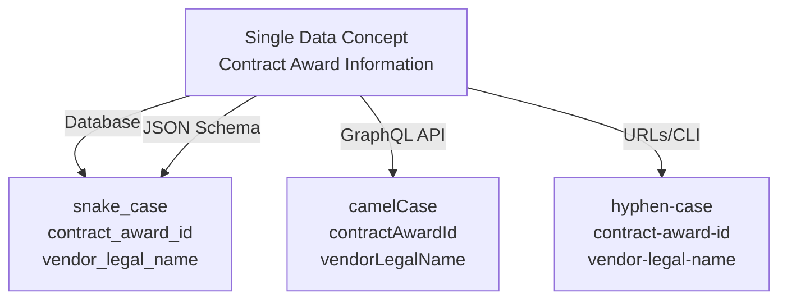

---

# Validation & Testing

## Quality Assurance Strategy

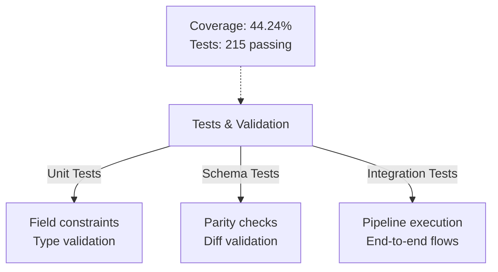

---

# Current Status: December 2025

## Achievements

✅ **6 system schemas** - Contract Data, Public Spending, Logistics Mgmt, Legacy Procurement, EASi, Schema Unification  
✅ **215 passing tests** - Comprehensive validation coverage  
✅ **44.24% code coverage** - Growing test suite  
✅ **Full schema generation** - JSON → GraphQL pipeline operational  
✅ **Apollo Federation** - Multi-schema composition working  
✅ **Documentation complete** - Auto-generated from schemas  

## Next Steps

- Enhance diff tool with x-graphql-field-name recognition
- Expand Logistics Mgmt schema (~2000 lines) 
- Full integration with Databricks Data Fabric
- AI model training on unified data

---

# Integration Architecture

## Connecting to Data Fabric

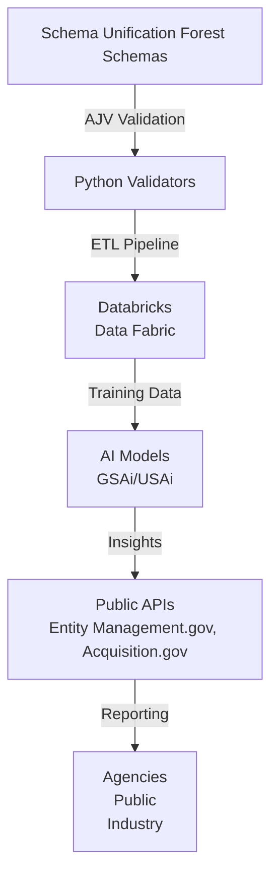

---

# Federal Procurement Data Fabric Players

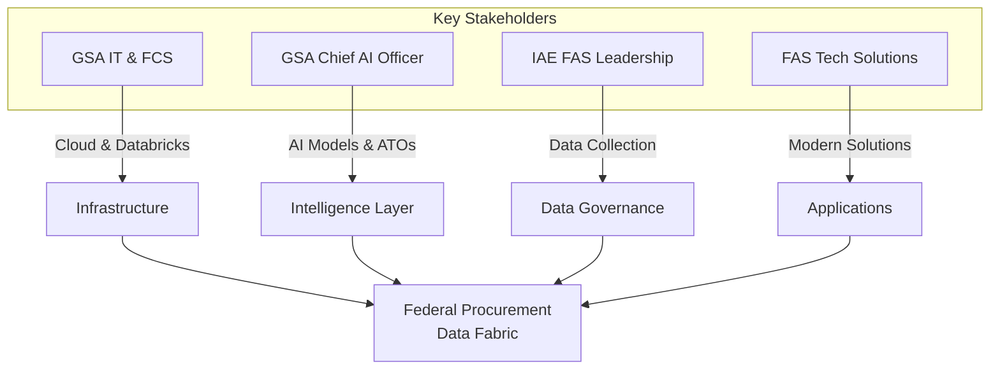

---

# Data Ingestion Strategy

## Multi-Source Integration Timeline

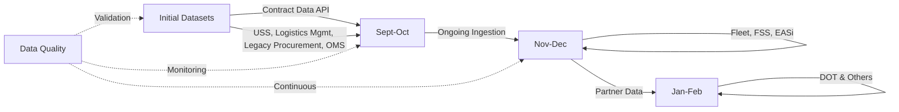

---

# Proposed Use Cases

## Immediate Applications

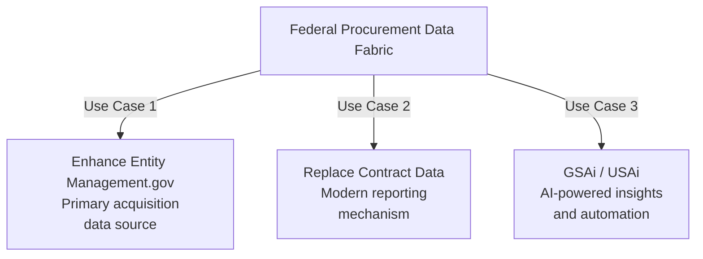

---

# Future State Architecture

## From Scattered Systems to Unified Fabric

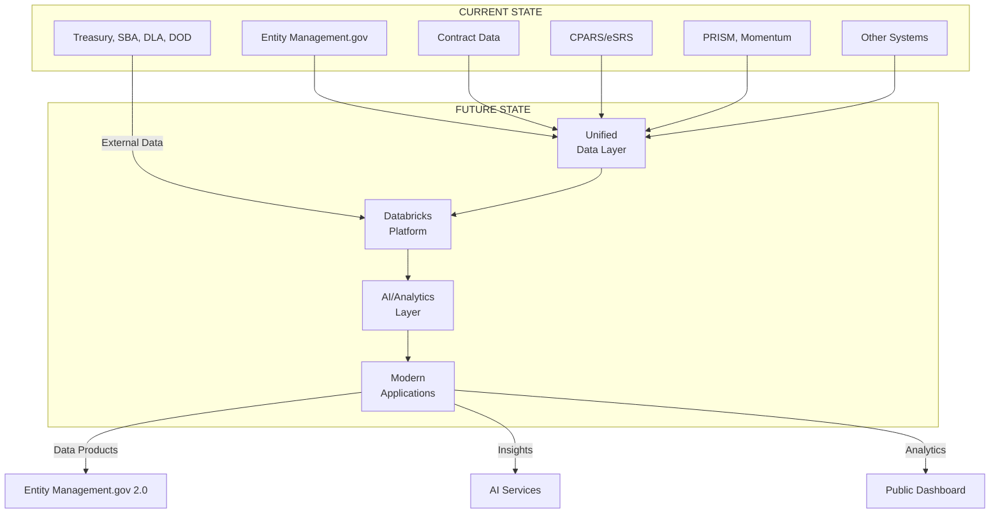

---

# Revolutionary FAR Overhaul Use Case

## Intelligent Acquisition Planning

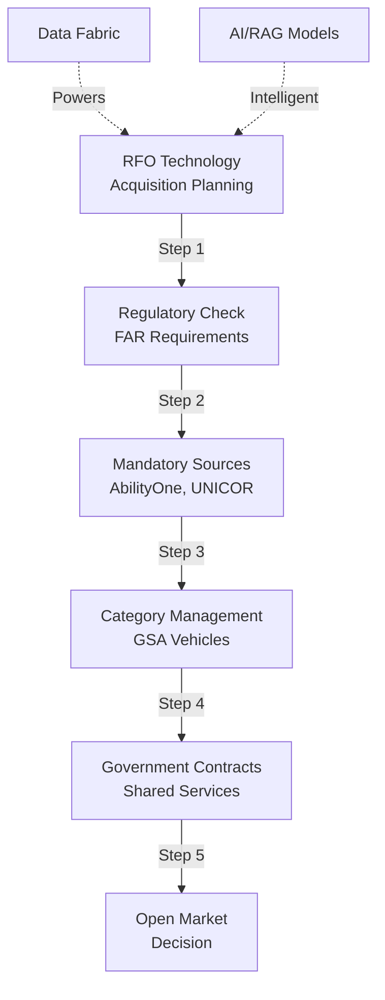

---

# Data Sources Supporting RFO

## Contract Data Requirements

- **GSA-Managed** - Federal Supply Schedule (FSS) contracts
- **Category Management** - Tier 2, 3, and Tier 4 contracts
- **External Agencies** - DHS, OPM, VA, DLA, NASA, USACE CM contracts
- **Format** - Highly unstructured (PDFs, various formats)
- **Solution** - Semantic RAG or Agentic RAG for intelligent navigation

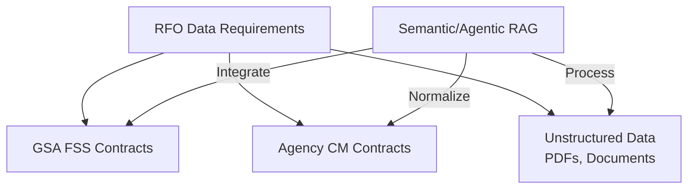

---

# Scripts & Tools

## Automation & Validation

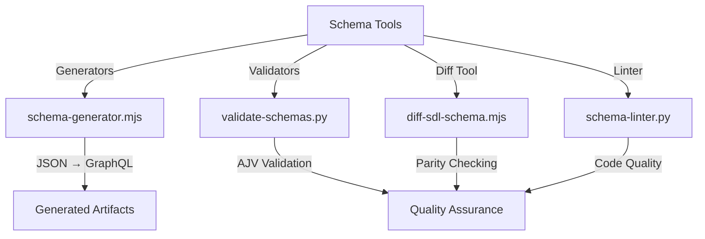

---

# Documentation Organization

## Schema & Process Documentation

- **adr/** - 9 architectural decision records
- **schema/** - JSON Schema definitions and specifications
- **mappings/** - Field name and type conversions
- **process/** - Workflows and procedures
- **examples/** - Sample queries and data
- **implementation/** - Integration guides
- **audit/** - Schema validation reports

---

# Technology Stack

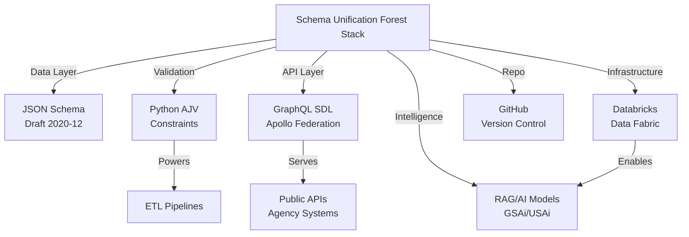

---

# Key Takeaways

## Schema Unification Forest Impact

1. **Single Source of Truth** - JSON Schema for all federal contract data
2. **Schema-Driven Development** - Generate APIs from data contracts
3. **Federal Procurement Data Fabric** - Implements modernization vision
4. **AI-Ready Data** - Clean, validated data for ML models
5. **Stakeholder Alignment** - Unified data model across agencies
6. **Future-Proof** - Extensible architecture for emerging needs

---

# Resources

## Documentation

- **GitHub**: github.com/GSA-TTS/enterprise-schema-unification
- **ADRs**: docs/adr/ (architectural decisions)
- **Schemas**: src/data/ (canonical source)
- **Examples**: docs/examples/
- **Quick Start**: docs/process/quick-start.md

## Team

- GSA Technology Transformation Services
- IAE Federal Procurement Data team
- Cross-agency collaboration

---

# Business Outcomes & Value

## Data Quality & Consistency

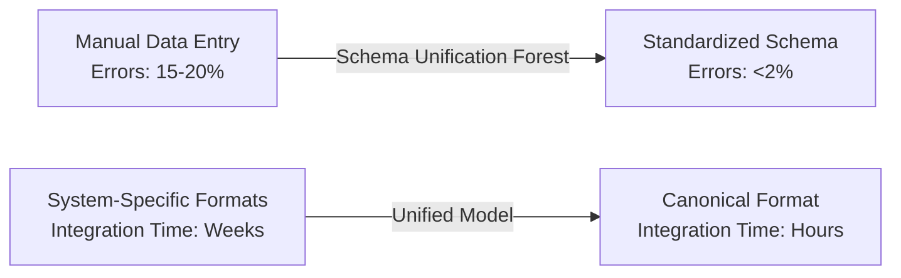

**Impact:** Reduce data reconciliation time by 80%, improve contract accuracy, enable reliable analytics

---

## Use Cases Enabled

- **Contract Intelligence:** Real-time visibility into federal procurement across all systems
- **Spend Analytics:** Unified analysis of $500B+ annual federal procurement data
- **Vendor Intelligence:** 360° view of vendor performance across agencies
- **Compliance Monitoring:** Automated policy adherence checking
- **Predictive Analytics:** ML-ready data for forecasting and risk modeling

---

## Analytics Capabilities

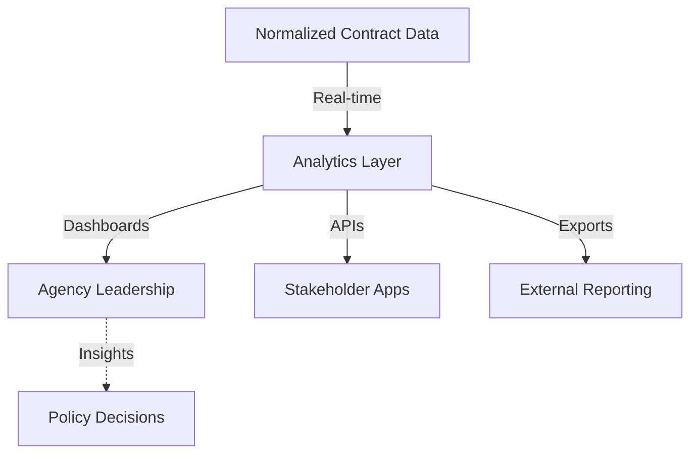

**Deliverables:** Pre-built dashboards, API access, scheduled reports, custom analytics

---

## ML/AI Readiness

Data quality improvements enable advanced use cases:

- **Demand Forecasting:** Predict procurement needs based on historical patterns
- **Risk Scoring:** Identify contract risks and compliance issues early
- **Vendor Recommendations:** Intelligent vendor matching based on requirements
- **Spend Optimization:** Find cost savings and consolidation opportunities
- **Fraud Detection:** Identify anomalous procurement patterns

---

# Getting Started

## Accessing Schema Unification Forest Data

### 1. Schema Exploration

**Interactive Schema Viewer:**
- Browse canonical data model: [https://schema-unification-project.site](placeholder)
- Explore field definitions and relationships
- View sample data for each system
- Check mapping between systems

### 2. GraphQL API Access

**Federation Gateway:**
```graphql
{
  contracts(first: 10) {
    edges {
      node {
        id
        contractTitle
        vendor { name uei }
        financialInfo { totalValue }
      }
    }
  }
}
```

**Request API Access:** [api-request@example.gov](placeholder)

### 3. Direct Data Access

**Available Formats:**
- JSON Schema (validation)
- GraphQL SDL (API)
- Parquet (analytics)
- CSV (reporting)

---

## Example Queries

### Find High-Value Contracts

```json
{
  "filter": {
    "financialInfo.totalValue": { "$gte": 1000000 },
    "status": "active"
  },
  "sort": { "financialInfo.totalValue": -1 },
  "limit": 100
}
```

### Vendor Performance Analysis

```json
{
  "aggregate": {
    "vendor": "$vendor.vendorUei",
    "count": { "$sum": 1 },
    "totalValue": { "$sum": "$financialInfo.totalValue" },
    "avgValue": { "$avg": "$financialInfo.totalValue" }
  },
  "sort": { "totalValue": -1 }
}
```

### Contract Data Integration Check

```json
{
  "filter": {
    "systemMetadata.sourceSystem": "Contract Data",
    "systemMetadata.lastValidated": { "$gte": "2025-01-01" }
  }
}
```

---

## Available Resources

### Documentation
- **[Schema Architecture Guide](docs/schema/schema-architecture.md)** — Data model overview
- **[API Integration Guide](docs/APIs/graphql-api-integration.md)** — Getting API access
- **[Python Validation Library](python/)** — Client-side validation
- **[Sample Datasets](resources/)** — Test data and examples

### Support Channels
- **Slack:** #schema-unification-project (GSA TTS workspace)
- **Email:** schema-unification-project@gsa.gov
- **GitHub:** [Issue Tracker](https://github.com/GSA-TTS/enterprise-schema-unification/issues)
- **Office Hours:** Thursdays 10 AM–11 AM ET

### Dashboards & Tools
- **Contract Dashboard:** [https://dashboards.example.gov/contracts](placeholder)
- **Vendor Analytics:** [https://dashboards.example.gov/vendors](placeholder)
- **Data Quality Report:** [https://dashboards.example.gov/quality](placeholder)

---

# Leadership Presentation

## 20-Minute Executive Overview

**Slides:** 2, 3, 4, 5, 6, 16, 18, 19, 20, 25, 26

**Key Messages:**
- **Problem:** Fragmented federal procurement data across systems
- **Solution:** Unified canonical data model (Schema Unification Forest)
- **Outcomes:** Data quality, analytics capability, ML readiness
- **Timeline:** Operational January 2026

**Visual Focus:**
- Problem statement and impact metrics
- Data fabric architecture
- Business outcomes and use cases
- Implementation roadmap

---

## Technical Deep-Dive

## 45-Minute Technical Presentation

**Slides:** 2, 3, 4, 7, 8, 9, 10, 11, 12, 13, 14, 15, 16, 17, 20, 21, 22, 23

**Key Topics:**
- Federal procurement landscape and challenges
- Schema-driven design principles
- x-graphql hints for advanced features
- Bidirectional schema conversion
- Federation and composition
- Implementation examples

**Interactive Elements:**
- Live schema viewer walkthrough
- GraphQL query examples
- Field mapping demonstration
- Q&A on specific system integrations

---

## Onboarding Presentation

## 30-Minute New Team Member Guide

**Slides:** 2, 6, 7, 8, 24, 25, 26, 27, 28

**Learning Objectives:**
- Understand Schema Unification Forest purpose and value
- Know how to access data and documentation
- Learn basic schema exploration
- Find help and support resources

**Hands-On Activities:**
- Schema browser walkthrough
- Execute sample query
- Review data quality metrics
- Identify relevant documentation

---

# Implementation Roadmap

## Phase 1: Foundation (Dec 2025 - Jan 2026)

```mermaid
gantt
    title Schema Unification Forest Implementation Timeline
    dateFormat YYYY-MM-DD
    
    section Foundation
    Schema Design :s1, 2025-12-01, 30d
    System Integration :s2, 2025-12-15, 45d
    
    section Operations
    API Gateway Launch :op1, 2026-01-01, 30d
    Dashboard Rollout :op2, 2026-01-15, 20d
    
    section Growth
    Advanced Analytics :gr1, 2026-02-01, 60d
    ML Pipeline Setup :gr2, 2026-03-01, 90d
```

---

## Next Steps

### For Data Teams
1. Review schema documentation
2. Request API access
3. Begin data validation
4. Schedule integration planning session

### For Leadership
1. Attend executive briefing
2. Identify strategic use cases
3. Allocate resources for implementation
4. Communicate vision to stakeholders

### For All
1. Join Slack channel
2. Attend office hours
3. Ask questions
4. Contribute feedback

---

# Questions?

## Let's Discuss

- How does Schema Unification Forest fit your data needs?
- What additional systems should be included?
- What are your use cases for this data?
- How can we collaborate on integration?
- What support do you need to get started?
