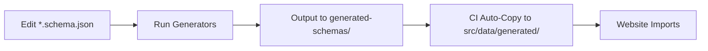

# Source Data Directory

This directory contains **canonical JSON Schema files** for the Schema Unification Forest project.

## ⚠️ Single Source of Truth

**JSON Schema with x-graphql-\* annotations** is the only authoritative source for both data validation and GraphQL SDL generation.

## Directory Structure

### 📝 Canonical Sources (Edit These)

These are snake_case JSON Schema files with x-graphql-\* extension metadata:

- **`schema_unification.schema.json`** - Unified supergraph schema (all systems)
- **`contract_data.schema.json`** - Federal Procurement Data System subgraph
- **`legacy_procurement.schema.json`** - Legacy Procurement subgraph
- **`intake_process.schema.json`** - EASi subgraph
- **`logistics_mgmt.schema.json`** - Logistics Mgmt subgraph
- **`public_spending.schema.json`** - Public Spending subgraph

Each schema includes:

- Standard JSON Schema validation rules (types, formats, required fields)
- `x-graphql-*` annotations for GraphQL SDL generation
- `x-graphql-federation-*` directives for Apollo Federation support

### 🤖 Auto-Generated (Do Not Edit)

- **`generated/`** - Mirror of `generated-schemas/` for Next.js imports
  - Auto-populated by CI workflows
  - Contains `*.subgraph.graphql`, `*.from-json.graphql`, etc.
  - See `generated/README.md` for details

### 📦 Legacy Files (Reference Only)

- **`archived/`** - Historical schema versions
  - `schema_unification.graphql.legacy` - Superseded SDL file (Dec 2025)

## Workflow



### Making Schema Changes

1. **Edit canonical schema:**

   ```bash
   vim src/data/contract_data.schema.json
   ```

2. **Validate schema:**

   ```bash
   pnpm run validate:schema
   python python/validate_schemas.py src/data/contract_data.schema.json
   ```

3. **Generate GraphQL SDL:**

   ```bash
   node scripts/generate-graphql-from-json-schema.mjs
   ```

4. **Validate parity:**

   ```bash
   pnpm run validate:sync
   ```

5. **Test:**
   ```bash
   pnpm test
   pytest python/tests/
   ```

## Key Conventions

### Naming Conventions

- **JSON Schema properties:** `snake_case` (database/validation domain)
- **GraphQL SDL fields:** `camelCase` (API domain)
- **Extension metadata:** `x-graphql-*` (tooling domain)

### Example

```json
{
  "properties": {
    "vendor_uei": {
      "type": "string",
      "description": "Unique Entity Identifier",
      "x-graphql-field-name": "vendorUei",
      "x-graphql-field-type": "String",
      "x-graphql-field-non-null": true
    }
  }
}
```

Generates:

```graphql
"""Unique Entity Identifier"""
vendorUei: String!
```

### When to Use x-graphql-\* Annotations

**Use x-graphql-field-name when:**

- Field name is truncated (e.g., `awarding_sub_tier_agency_c` → `awardingSubTierAgencyCode`)
- Not a clean snake_case → camelCase conversion

**Use x-graphql-field-type when:**

- Type differs from JSON Schema default
- `DateTime`, `Decimal`, `Email`, `URI` (custom scalars)
- NOT needed for `String`, `Int`, `Boolean`

**Use x-graphql-field-non-null when:**

- Field should be required in GraphQL (adds `!`)
- Even if in JSON Schema `required` array

**Use x-graphql-federation-\* when:**

- Defining entity keys: `x-graphql-federation-keys`
- Marking shareable types: `x-graphql-federation-shareable`
- External fields: `x-graphql-federation-external`
- Computed fields: `x-graphql-federation-requires`

## Federation Support

All schemas support Apollo Federation v2.9:

- **Entity keys:** `x-graphql-federation-keys: ["id", "unique_key"]`
- **Shareable types:** `x-graphql-federation-shareable: true`
- **Authorization:** `x-graphql-federation-authenticated: true`
- **Demand control:** `x-graphql-federation-cost-weight: 10`

See [x-graphql Hints Guide](../docs/x-graphql-hints-guide.md) for complete reference.

## Validation

### JSON Schema Validation (Python)

```bash
# Validate single schema
python python/validate_schemas.py src/data/contract_data.schema.json

# Validate all schemas
python python/validate_schemas.py src/data/*.schema.json

# Run tests
pytest python/tests/ -v
```

### GraphQL Validation (Node.js)

```bash
# Validate all schemas
pnpm run validate:all

# Check GraphQL SDL
pnpm run validate:graphql

# Check parity (JSON ↔ SDL)
pnpm run validate:sync
```

## CI/CD Integration

GitHub Actions workflows automatically:

1. Validate all JSON Schema files
2. Generate GraphQL SDL from schemas
3. Check parity between JSON Schema and SDL
4. Copy generated files to `src/data/generated/`
5. Run integration tests

See `.github/workflows/schema-validate-generate.yml` for details.

## Related Documentation

- [x-graphql Hints Guide](../docs/x-graphql-hints-guide.md)
- [Schema Architecture Guide](../docs/SCHEMA-ARCHITECTURE.md)
- [Schema Pipeline Guide](../docs/schema-pipeline-guide.md)
- [Python Validation Guide](../docs/python-validation-guide.md)

## Quick Reference

| Task                 | Command                                                    |
| -------------------- | ---------------------------------------------------------- |
| Edit schema          | `vim src/data/*.schema.json`                               |
| Validate JSON Schema | `python python/validate_schemas.py src/data/*.schema.json` |
| Generate SDL         | `node scripts/generate-graphql-from-json-schema.mjs`       |
| Validate all         | `pnpm run validate:all`                                    |
| Run tests            | `pnpm test && pytest`                                      |
| Build website        | `pnpm build`                                               |
