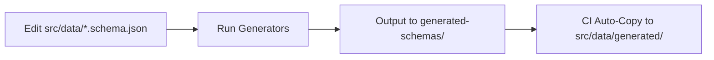

# Auto-Generated Directory - Do Not Edit

This directory is **automatically populated by CI workflows** from `generated-schemas/`.

## Purpose

Provides direct imports for the Next.js website without requiring build-time schema copying.

## Populated By

- `.github/workflows/schema-validate-generate.yml` - Main schema generation workflow
- `.github/workflows/composition.yml` - Federation composition
- Generator scripts with `--no-generated-copy=false` (default)

## Contents

All files here are mirrors of `generated-schemas/`:

- `*.subgraph.graphql` - Federation subgraph SDL files
- `*.from-json.graphql` - Generated SDL from JSON Schema
- `schema_unification.supergraph.graphql` - Composed supergraph
- `schema_unification.from-graphql.json` - Generated JSON Schema from SDL

## Workflow

## Important

❌ **Do NOT manually edit files in this directory**  
✅ **Edit canonical schemas in `src/data/*.schema.json`**  
✅ **Run generators to update: `pnpm run generate:schema:interop`**

---

**Source of Truth:** `src/data/*.schema.json` (with x-graphql-\* annotations)
